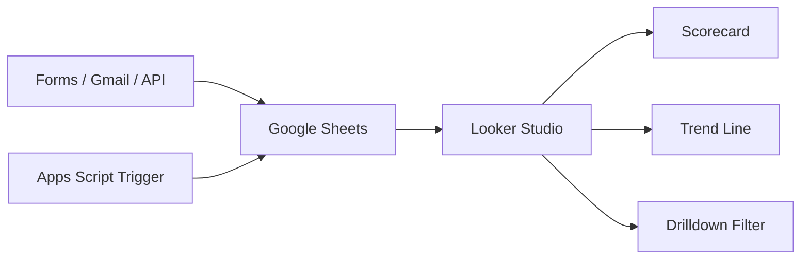

<div class="kicker">세아지주 AI 교육 > 3일 과정 > Day 1</div>

# Google Workspace 자동화와<br/>Agent 기획

<p class="lead">Workspace · Apps Script · Looker Studio 심화 실습을 통해 교육 후 즉시 활용 가능한 자동화 툴과 Agent 기획서를 만듭니다.</p>

<div class="tool-strip">
  <span><logos-google-gemini /> Gemini</span>
  <span><logos-google-workspace /> Workspace</span>
  <span><logos-google-data-studio /> Looker Studio</span>
  <span><carbon-flow /> 자동화 흐름</span>
</div>

---

<div class="kicker">세아지주 AI 교육 > 전체 흐름 > 3일 로드맵</div>

# 3일 로드맵

<div class="course-roadmap">
  <div class="day-card active">
    <em>Day 1</em>
    <b>Google Workspace 자동화</b>
    <span>업무 데이터를 정리하고, 반복 처리 파이프라인을 만든 뒤, Agent로 풀 문제를 선별한다.</span>
    <div class="tool-tags"><i>Gemini</i><i>Apps Script</i><i>Looker Studio</i></div>
    <strong>산출물: 자동화 툴 + Agent 기획서 + 프로토타입 코드</strong>
  </div>
  <div class="day-card">
    <em>Day 2</em>
    <b>Gemini API + Antigravity Agent 개발</b>
    <span>Function Calling, RAG, Agent Loop를 이해하고 실제 부서 Painpoint 해결 Agent를 만든다.</span>
    <div class="tool-tags"><i>Gemini API</i><i>Antigravity</i><i>RAG</i></div>
    <strong>산출물: 동작하는 Agent 서비스</strong>
  </div>
  <div class="day-card">
    <em>Day 3</em>
    <b>Cloud Run 배포와 Demo Day</b>
    <span>Agent를 완성·배포하고, 팀별 시연과 확장 로드맵으로 교육 결과를 정리한다.</span>
    <div class="tool-tags"><i>Cloud Run</i><i>Antigravity</i><i>Gemini</i></div>
    <strong>산출물: 배포 URL + 확장 계획</strong>
  </div>
</div>

---

<div class="kicker">세아지주 AI 교육 > Day 1 역할 > 기반 만들기</div>

# Day 1 역할: 개발 문제 정제

<div class="day-role">
  <div>
    <span>📥 <strong>입력</strong></span>
    <b>부서별 반복 업무와 문서·메일·시트 데이터</b>
    <p>수강생이 제출한 AX 기획 아이디어와 현장 Painpoint를 실제 업무 흐름으로 펼친다.</p>
  </div>
  <div>
    <span>⚙️ <strong>처리</strong></span>
    <b>Workspace 자동화 실습</b>
    <p>Gemini, Apps Script, Looker Studio로 바로 쓰는 자동화 산출물을 만든다.</p>
  </div>
  <div>
    <span>📤 <strong>출력</strong></span>
    <b>Day 2 Agent 개발 요구사항</b>
    <p>Agent가 필요한 일과 단순 자동화로 충분한 일을 구분해 PRD와 프로토타입 코드 방향으로 넘긴다.</p>
  </div>
</div>

---

<div class="kicker">세아지주 AI 교육 > Day 1 개요 > 상세 커리큘럼</div>

# 1일차 상세 커리큘럼

<p class="sublead">Workspace · Apps Script · Looker Studio 심화 실습 과정으로, 각 파트는 바로 사용할 산출물 하나를 남깁니다.</p>

<div class="curriculum-board">
  <div>
    <em>09:00–11:00</em>
    <b>Gemini 심화 프롬프팅 & Workspace AI 활용</b>
    <ul>
      <li>역할 기반 시스템 프롬프트와 Few-shot 패턴</li>
      <li>할루시네이션 방지용 검증 루프 프롬프트</li>
      <li>NotebookLM 사내 문서 RAG 지식 허브</li>
      <li>Sheets `=GEMINI()` 분류·요약·초안 생성</li>
      <li>Docs/Slides 보고서 초안 자동 생성</li>
    </ul>
    <strong>부서 맞춤형 Gem 세트 + Sheets AI 분석 시트</strong>
  </div>
  <div>
    <em>12:00–14:30</em>
    <b>Apps Script 고도화: 이벤트 기반 자동화·외부 API 연동</b>
    <ul>
      <li>onFormSubmit · 시간 기반 · onChange 트리거</li>
      <li>Form → Sheet → Gmail 자동 답신 파이프라인</li>
      <li>UrlFetchApp으로 환율·뉴스 데이터 자동 수집</li>
      <li>Drive + Calendar 일정·파일 관리 봇</li>
      <li>Logger / Webhook 기반 실패 알림</li>
    </ul>
    <strong>실제 동작하는 이메일 자동 처리 시스템</strong>
  </div>
  <div>
    <em>14:30–16:00</em>
    <b>Looker Studio: 의사결정용 실시간 대시보드</b>
    <ul>
      <li>Sheets → Looker Studio 실시간 연결</li>
      <li>스코어카드 · 트렌드 라인 · 드릴다운 필터</li>
      <li>부서별 KPI 대시보드와 공유 URL</li>
      <li>Apps Script 스케줄러 기반 자동 갱신</li>
    </ul>
    <strong>공유 가능한 KPI 대시보드 URL</strong>
  </div>
  <div>
    <em>16:00–17:00</em>
    <b>본사 부서 Painpoint 진단 & Agent 기획</b>
    <ul>
      <li>팀별 반복 업무와 시간 소요 지점 도출</li>
      <li>계약서 검토 · 규정 Q&A · 해외법인 보고 통합 시나리오</li>
      <li>자동화로 충분한 일과 Agent가 필요한 일 구분</li>
    </ul>
    <strong>팀별 Agent 기획서 + 프로토타입 코드</strong>
  </div>
</div>

---

<div class="kicker">세아지주 AI 교육 > Day 1 개요 > 7시간 구조</div>

# Day 1 시간표

<div class="schedule-track">
  <div class="time-slot">
    <b>09:00–11:00</b>
    <span>Gemini 심화 프롬프팅 & Workspace AI 활용</span>
    <em>Gem 세트 · 검증 루프 · NotebookLM · Sheets AI</em>
  </div>
  <div class="time-slot lunch">
    <b>11:00–12:00</b>
    <span>점심시간</span>
    <em>오전 실습 결과 저장, 오후 자동화 실습 준비</em>
  </div>
  <div class="time-slot">
    <b>12:00–14:30</b>
    <span>Apps Script 고도화</span>
    <em>트리거 · 자동 답신 · 외부 API · 실패 알림</em>
  </div>
  <div class="time-slot">
    <b>14:30–16:00</b>
    <span>Looker Studio 대시보드</span>
    <em>실시간 연결 · KPI 화면 · 자동 갱신</em>
  </div>
  <div class="time-slot">
    <b>16:00–17:00</b>
    <span>Painpoint 진단 & Agent 기획</span>
    <em>팀별 Agent 기획서 + 프로토타입 코드</em>
  </div>
</div>

---

<div class="kicker">세아지주 AI 교육 > Day 1 산출물 > 완료 기준</div>

# Day 1 산출물

<div class="outcome-grid">
  <div>
    <span>🧰</span>
    <b>이메일 자동 처리 시스템</b>
    <p>Form, Sheet, Gmail, Drive, Calendar를 연결한 이벤트 기반 파이프라인</p>
  </div>
  <div>
    <span>📊</span>
    <b>KPI 대시보드 URL</b>
    <p>Looker Studio 스코어카드, 트렌드 라인, 드릴다운 필터와 자동 갱신 구조</p>
  </div>
  <div>
    <span>🤖</span>
    <b>Agent 기획서 + 코드 초안</b>
    <p>Day 2에 Gemini API와 Antigravity로 개발할 팀별 문제 정의와 프로토타입 코드 방향</p>
  </div>
</div>

<div class="evidence-band">완료 증거: 자동화 실행 결과 · 대시보드 공유 URL · Agent PRD 초안 · 프로토타입 코드 스케치</div>

---
layout: section
---

<div class="kicker">Day 1 > Part 1 > Gemini와 Workspace</div>

# Gemini 심화 프롬프팅 & Workspace AI 활용

<p class="lead">09:00–11:00 · 역할 기반 프롬프트, 검증 루프, NotebookLM, Sheets AI를 묶어 부서 맞춤형 Gem 세트와 분석 시트를 만든다.</p>

---

<div class="kicker">Day 1 > Gemini와 Workspace > 도구 소개</div>

# Gemini 서비스 화면

<div class="screenshot-layout">
  <div>
    
  </div>
  <div>
    <simple-icons-googlegemini />
    <b>Gemini</b>
    <span>질문 입력창, 모델 선택, 도구 호출이 한 화면에 있는 범용 AI assistant입니다. 오늘은 이 대화형 사용법을 Workspace 데이터 처리로 확장합니다.</span>
    <small>출처: gemini.google.com 공개 화면 캡처</small>
  </div>
</div>

---

<div class="kicker">Day 1 > Gemini와 Workspace > 모델 이해</div>

# Gemini 3.5 Flash

<div class="model-compare">
  <div class="model-primary">
    <simple-icons-googlegemini />
    <b>Gemini 3.5 Flash</b>
    <p>Google이 2026년 5월 발표한 최신 Flash 모델입니다. agentic task와 coding 성능, 속도를 강조하며 Gemini app, AI Mode, Gemini API, Antigravity, Gemini Enterprise에서 제공됩니다.</p>
  </div>
  <div>
    <simple-icons-openai />
    <b>OpenAI GPT</b>
    <p>비슷한 범주의 범용 LLM 제품군. 업무에서는 초안 작성, 추론, 코드 생성, 도구 호출 비교 대상으로 자주 등장합니다.</p>
  </div>
  <div>
    <simple-icons-claude />
    <b>Anthropic Claude</b>
    <p>비슷한 범주의 범용 LLM 제품군. 긴 문서 읽기, 분석, 안전성 기준 비교 대상으로 자주 언급됩니다.</p>
  </div>
</div>

<div class="source-line">출처: Google Blog, “Gemini 3.5: frontier intelligence with action”, 2026-05</div>

---

<div class="kicker">Day 1 > Gemini와 Workspace > 도구 소개</div>

# Google Workspace

<div class="tool-intro-grid">
  <div>
    <logos-google-workspace />
    <b>업무 데이터가 생기는 곳</b>
    <span>Gmail, Docs, Sheets, Slides, Drive, Calendar는 업무 요청, 문서, 표, 파일, 일정이 실제로 쌓이는 작업 공간입니다.</span>
  </div>
  <div>
    <carbon-flow />
    <b>AI가 붙는 방식</b>
    <span>Gemini는 Workspace 안의 데이터를 읽고, 분류하고, 초안을 만들고, Apps Script/Looker Studio와 연결되어 실행 흐름이 됩니다.</span>
  </div>
</div>

---

<div class="kicker">Day 1 > Gemini와 Workspace > 처리 흐름</div>

# Workspace AI 처리 흐름

<div class="process-list">
  <div><em>01</em><b>수집</b><span>Docs · Gmail · Drive · Forms에서 업무 맥락과 원천 데이터를 모은다.</span></div>
  <div><em>02</em><b>분류</b><span>Gemini로 요청 유형, 긴급도, 담당 조직, 후속 액션을 태깅한다.</span></div>
  <div><em>03</em><b>요약/검증</b><span>보고 가능한 문장으로 바꾸고 근거·확인 질문을 함께 남긴다.</span></div>
  <div><em>04</em><b>전달</b><span>Sheets, Gmail, Slides, Looker Studio로 결과물을 배포한다.</span></div>
</div>

---

<div class="kicker">Day 1 > Gemini와 Workspace > 프롬프트 개념</div>

# 프롬프트 기본 개념

<div class="definition-grid">
  <div>
    <carbon-chat />
    <b>프롬프트</b>
    <span>AI에게 맡길 역할, 입력 데이터, 출력 형식, 금지 조건, 검증 기준을 적은 작업 지시문</span>
  </div>
  <div>
    <carbon-document />
    <b>업무형 프롬프트</b>
    <span>“잘 답해줘”가 아니라 “이 업무 기준으로 분류하고, 근거와 확인 질문을 남겨줘”에 가깝다.</span>
  </div>
  <div>
    <carbon-checkmark />
    <b>완료 기준</b>
    <span>응답 문장보다 재사용 가능한 지시 구조와 검토 가능한 근거가 남아야 한다.</span>
  </div>
</div>

---

<div class="kicker">Day 1 > Gemini와 Workspace > Gem 세트</div>

# 부서 맞춤형 Gem 세트

<div class="gem-system-grid">
  <div>
    <em>01</em>
    <b>역할</b>
    <span>“본사 HR 운영팀”, “경영관리 KPI 검토자”처럼 책임과 판단 범위를 고정한다.</span>
  </div>
  <div>
    <em>02</em>
    <b>업무 기준</b>
    <span>분류 기준, 금지 표현, 승인 필요 조건, 조직 용어를 시스템 프롬프트에 넣는다.</span>
  </div>
  <div>
    <em>03</em>
    <b>출력 형식</b>
    <span>요약, 담당자, 긴급도, 근거, 확인 질문을 항상 같은 구조로 반환하게 한다.</span>
  </div>
  <div>
    <em>04</em>
    <b>검증</b>
    <span>근거 없는 추정은 “확인 필요”로 표시하고, 발송 전 사람 승인 지점을 남긴다.</span>
  </div>
</div>

<div class="source-line">실습 포인트: 개인 채팅 프롬프트가 아니라 팀에서 반복해서 쓰는 업무 프롬프트 세트를 만든다.</div>

---

<div class="kicker">Day 1 > Gemini와 Workspace > Few-shot 패턴</div>

# Few-shot · 단계별 검토 패턴

<div class="pattern-grid">
  <div>
    <b>Few-shot</b>
    <p>좋은 입력과 좋은 출력 예시를 2~3개 넣어, Gemini가 분류 기준과 문체를 따라오게 한다.</p>
  </div>
  <div>
    <b>단계별 검토</b>
    <p>내부 추론을 길게 요구하기보다 `확인한 근거`, `불확실한 항목`, `다음 질문`을 분리해 달라고 요청한다.</p>
  </div>
  <div>
    <b>업무 적용</b>
    <p>요청 메일을 계약·정산·인사·기타로 분류하고, 담당자와 답장 초안을 표준 형식으로 남긴다.</p>
  </div>
</div>

```md
[예시 1] 계약서 검토 요청 → 계약 / 긴급도 높음 / 법무 확인 필요
[예시 2] 정산 누락 문의 → 정산 / 긴급도 중간 / 매입 자료 확인 필요
아래 신규 요청도 같은 기준으로 분류하고, 근거와 확인 질문을 함께 작성해 주세요.
```

---

<div class="kicker">Day 1 > Gemini와 Workspace > 역할 기반 프롬프트</div>

# 프롬프트 설계:<br/>Role · Context · Check

<div class="prompt-formula">
  <div>
    <b>🎭 Role</b>
    <span>“본사 HR 운영팀의 주간 리포트 검토자”처럼 업무 책임을 지정한다.</span>
  </div>
  <div>
    <b>📎 Context</b>
    <span>문서, 표, 메일 원문, 제외 조건, 조직 용어를 함께 제공한다.</span>
  </div>
  <div>
    <b>✅ Check</b>
    <span>불확실한 내용, 근거 셀, 재확인 질문을 결과에 포함시킨다.</span>
  </div>
</div>

<div class="spacer-sm"></div>

```md
당신은 본사 경영관리팀의 월간 KPI 리포트 검토자입니다.
아래 시트 데이터를 기준으로 이상치, 원인 가설, 추가 확인 질문을 분리해 주세요.
근거가 부족한 내용은 "확인 필요"로 표시하고, 추정 문장을 확정처럼 쓰지 마세요.
```

---

<div class="kicker">Day 1 > Gemini와 Workspace > 할루시네이션 방지</div>

# 검증 루프 기본 개념

<div class="definition-grid">
  <div>
    <carbon-search />
    <b>검증 루프</b>
    <span>AI 답변을 그대로 쓰지 않고, 근거·반례·사람 승인을 거쳐 업무 결과로 확정하는 반복 절차</span>
  </div>
  <div>
    <carbon-warning />
    <b>필요한 이유</b>
    <span>할루시네이션, 오래된 정보, 누락 조건, 권한 밖 판단을 업무 발송 전에 걸러낸다.</span>
  </div>
  <div>
    <carbon-loop />
    <b>실무 기준</b>
    <span>자동 생성보다 자동 검토 지점을 먼저 설계해야 운영 가능한 자동화가 된다.</span>
  </div>
</div>

---

<div class="kicker">Day 1 > Gemini와 Workspace > 할루시네이션 방지</div>

# 검증 루프: 근거 · 반례 · 승인

<div class="verification-steps">
  <div><em>1</em><b>답변 생성</b><span>Gemini가 요약, 분류, 초안을 만든다.</span></div>
  <div><em>2</em><b>근거 표시</b><span>셀 주소, 문서 섹션, 메일 제목을 함께 남긴다.</span></div>
  <div><em>3</em><b>반례 질문</b><span>누락 조건과 충돌 데이터를 다시 묻는다.</span></div>
  <div><em>4</em><b>사람 승인</b><span>발송·공유 전 최종 판단 지점을 둔다.</span></div>
</div>

<div class="bottom-line">실습에서는 “정답 요청”보다 “근거와 불확실성을 남기는 요청”을 표준 패턴으로 씁니다.</div>

---

<div class="kicker">Day 1 > Gemini와 Workspace > NotebookLM</div>

# NotebookLM 기본 개념

<div class="definition-grid">
  <div>
    <logos-google-icon />
    <b>NotebookLM</b>
    <span>업로드한 문서 묶음을 근거로 질문하고 요약하는 Google의 문서 기반 AI 노트북</span>
  </div>
  <div>
    <carbon-document-attachment />
    <b>Source Grounding</b>
    <span>답변이 어떤 문서와 섹션을 근거로 하는지 추적하기 쉬워 사내 문서 Q&A에 적합하다.</span>
  </div>
  <div>
    <carbon-network-4 />
    <b>Day 2 연결</b>
    <span>문서 묶음과 질문 목록은 RAG Agent의 초기 지식 베이스 후보가 된다.</span>
  </div>
</div>

---

<div class="kicker">Day 1 > Gemini와 Workspace > NotebookLM</div>

# NotebookLM: 사내 문서 RAG 허브

<div class="screenshot-layout notebook">
  <div>
    
  </div>
  <div>
    <b>Sources · Chat · Studio</b>
    <span>Google은 NotebookLM의 새 UI를 Sources, Chat, Studio의 3영역 구조로 설명합니다. 소스를 관리하고, 근거 기반으로 질문하며, Study Guide/Briefing Doc/Audio Overview 같은 산출물을 만듭니다.</span>
    <small>출처: Google Blog, “NotebookLM gets a new look...”, 2024-12</small>
  </div>
</div>

---

<div class="kicker">Day 1 > Gemini와 Workspace > NotebookLM 활용</div>

# NotebookLM 활용 반응

<div class="evidence-grid">
  <div>
    <b>🗂️ 소스 묶음</b>
    <span>Google은 NotebookLM을 “사용자가 가진 소스에 근거한 research assistant”로 설명합니다.</span>
    <small>Google Blog, 2025-07</small>
  </div>
  <div>
    <b>💬 실제 사용법</b>
    <span>최근 문서 10개를 한 노트북에 넣고 질문해보는 방식, 프로젝트별 노트북 운영 방식이 소개됩니다.</span>
    <small>Google Blog, beginner tips</small>
  </div>
  <div>
    <b>🎧 사용자 반응</b>
    <span>Audio Overviews는 사용량이 빠르게 늘었고, 80개 이상 언어 지원 후 생성량이 2주 만에 두 배가 되었다고 Google은 설명합니다.</span>
    <small>Google Blog, 2025-07</small>
  </div>
</div>

---

<div class="kicker">Day 1 > Gemini와 Workspace > Sheets AI</div>

# Google Sheets AI 기본 개념

<div class="definition-grid">
  <div>
    <logos-google-drive />
    <b>Google Sheets</b>
    <span>행과 열로 업무 데이터를 정리하고, 계산·필터·공유·자동화를 붙이는 스프레드시트 도구</span>
  </div>
  <div>
    <logos-google-gemini />
    <b>Sheets AI</b>
    <span>셀 범위의 문맥을 읽어 분류, 요약, 초안 작성, 항목 추출을 표 작업 안에서 수행한다.</span>
  </div>
  <div>
    <carbon-data-table />
    <b>실습 관점</b>
    <span>메일·요청·보고 데이터를 행 단위로 넣고, Gemini 처리 열을 추가해 운영 가능한 시트를 만든다.</span>
  </div>
</div>

---

<div class="kicker">Day 1 > Gemini와 Workspace > Sheets AI</div>

# Sheets AI: 분류 · 요약 · 초안 생성

<div class="lane-comparison">
  <div class="lane">
    <h3><logos-google-gmail /> 메일 원문</h3>
    <p>제목, 본문, 발신자, 요청 마감일을 행 단위로 정리한다.</p>
    <div class="lane-tags"><span>raw</span><span>request</span><span>owner</span></div>
  </div>
  <div class="lane">
    <h3><logos-google-gemini /> Gemini 처리 열</h3>
    <p>유형, 긴급도, 요약, 답장 초안, 확인 필요 항목을 자동 생성한다.</p>
    <div class="lane-tags"><span>classify</span><span>summarize</span><span>draft</span></div>
  </div>
</div>

```txt
=GEMINI("이 요청을 계약/정산/인사/기타로 분류하고, 담당자에게 보낼 답장 초안을 작성해줘", A2:D2)
```

---

<div class="kicker">Day 1 > Gemini와 Workspace > Docs와 Slides</div>

# 보고서 초안 구조화

<div class="component-grid">
  <div>
    <b>🧱 목차 생성</b>
    <span>목적, 현황, 이슈, 의사결정 요청으로 보고 구조를 고정한다.</span>
  </div>
  <div>
    <b>📝 본문 초안</b>
    <span>시트 요약과 근거 링크를 문단으로 변환한다.</span>
  </div>
  <div>
    <b>🎯 임원용 요약</b>
    <span>3줄 요약, 의사결정 포인트, 리스크만 앞에 배치한다.</span>
  </div>
  <div>
    <b>📎 근거 링크</b>
    <span>원본 문서, 시트, 메일 링크를 남겨 검토 흐름을 유지한다.</span>
  </div>
</div>

---

<div class="kicker">Day 1 > Gemini와 Workspace > 실습 산출물</div>

# Part 1 실습 안내

<div class="practice-brief">
  <div><em>목표</em><b>Gemini로 업무 요청 데이터를 읽고 처리 기준을 만든다.</b></div>
  <div><em>시작 화면</em><b>Gemini · NotebookLM · Google Sheets</b></div>
  <div><em>수행</em><b>프롬프트 3종 작성 → 시트 분류/요약 → NotebookLM 질문 목록 정리</b></div>
  <div><em>완료 증거</em><b>Gem 세트, Sheets AI 분석 시트, RAG 후보 질문 목록</b></div>
</div>

---

<div class="kicker">Day 1 > Gemini와 Workspace > 실습 산출물</div>

# Part 1 체크리스트

<div class="checklist-board">
  <div>
    <span>✅</span>
    <b>부서 맞춤형 Gem 세트</b>
    <p>역할 기반 시스템 프롬프트, Few-shot 예시, 검증 루프 프롬프트</p>
  </div>
  <div>
    <span>✅</span>
    <b>Sheets AI 분석 시트</b>
    <p>=GEMINI() 함수로 업무 요청을 분류·요약하고 답장 초안을 만든다.</p>
  </div>
  <div>
    <span>✅</span>
    <b>NotebookLM + 보고서 초안</b>
    <p>사내 문서 RAG 질문 목록과 Docs/Slides 보고서 초안 구조를 정리한다.</p>
  </div>
</div>

---
layout: section
---

<div class="kicker">Day 1 > Part 2 > Apps Script</div>

# Apps Script 고도화: 이벤트 기반 자동화와 API 연동

<p class="lead">12:00–14:30 · 트리거, 자동 답신, 외부 API 수집, Drive/Calendar 봇, 실패 알림까지 실제 동작하는 자동 처리 시스템을 만든다.</p>

---

<div class="kicker">Day 1 > Apps Script > 실습 안내</div>

# Apps Script 실습 안내

<div class="practice-brief">
  <div><em>목표</em><b>이벤트가 발생하면 Workspace 앱이 자동으로 움직이게 만든다.</b></div>
  <div><em>시작 화면</em><b>Google Form · Sheet · Apps Script 편집기</b></div>
  <div><em>수행</em><b>트리거 설정 → Gmail 답신 → API 수집 → Drive/Calendar 연동 → 실패 알림</b></div>
  <div><em>완료 증거</em><b>메일 발송 로그, 시트 기록, Slack/Webhook 실패 알림 테스트</b></div>
</div>

---

<div class="kicker">Day 1 > Apps Script > 자동화 관점</div>

# Apps Script: Workspace 접착제

<div class="statement-panel">
  <b>트리거가 이벤트를 감지하고, 스크립트가 판단하며, Workspace 앱이 결과를 실행한다.</b>
  <span>수작업으로 반복하던 “확인 → 복사 → 발송 → 기록”을 하나의 운영 흐름으로 묶는다.</span>
</div>

<div class="tool-strip compact">
  <span><logos-google-gsuite /> Forms</span>
  <span><logos-google-drive /> Drive</span>
  <span><logos-google-gmail /> Gmail</span>
  <span><logos-google-calendar /> Calendar</span>
  <span><carbon-api /> External API</span>
</div>

---

<div class="kicker">Day 1 > Apps Script > 트리거 설계</div>

# 트리거 설계: 실행 순간

<div class="trigger-grid">
  <div>
    <carbon-event />
    <b>onFormSubmit</b>
    <span>신청, 문의, 요청이 들어오는 즉시 후속 처리를 시작한다.</span>
  </div>
  <div>
    <carbon-time />
    <b>시간 기반</b>
    <span>매일 오전 9시, 매주 월요일처럼 정해진 주기로 API 수집과 대시보드 갱신을 실행한다.</span>
  </div>
  <div>
    <carbon-data-table />
    <b>onChange</b>
    <span>시트 구조나 데이터 변경을 감지해 집계·알림을 갱신한다.</span>
  </div>
</div>

---

<div class="kicker">Day 1 > Apps Script > 실습 1</div>

# Form → Sheet → Gmail 자동 답신 파이프라인

<div class="pipeline-row">
  <div><logos-google-gsuite /><b>Form 제출</b><span>요청 접수</span></div>
  <div><carbon-arrow-right /></div>
  <div><logos-google-drive /><b>Sheet 기록</b><span>담당/유형 분류</span></div>
  <div><carbon-arrow-right /></div>
  <div><logos-google-gmail /><b>Gmail 발송</b><span>확인 메일 자동 회신</span></div>
</div>

```js
function onFormSubmit(e) {
  const row = e.values
  const requester = row[1]
  const requestType = row[3]

  GmailApp.sendEmail(
    requester,
    `[접수 완료] ${requestType} 요청`,
    '요청이 접수되었습니다. 담당자 확인 후 회신드리겠습니다.'
  )
}
```

---

<div class="kicker">Day 1 > Apps Script > 실습 2</div>

# 외부 API 연동: 최신 데이터 수집

<div class="api-contrast">
  <div>
    <b>수동 업데이트</b>
    <p>환율, 뉴스, 공시, 가격 정보를 사람이 찾아 붙여 넣는다.</p>
  </div>
  <div>
    <b>UrlFetchApp 연동</b>
    <p>정해진 시간에 API를 호출하고 Sheet에 기록해 보고서와 대시보드를 갱신한다.</p>
  </div>
</div>

```js
function fetchExchangeRate() {
  const res = UrlFetchApp.fetch('https://api.example.com/rates-or-news')
  const data = JSON.parse(res.getContentText())
  SpreadsheetApp.getActiveSheet().appendRow([new Date(), data.usdKrw])
}
```

---

<div class="kicker">Day 1 > Apps Script > 실습 3</div>

# Drive · Calendar 일정/파일 관리 봇

<div class="stage-grid">
  <div class="stage-card">
    <span class="stage-num">01</span>
    <h3>폴더 생성</h3>
    <p>요청 유형별 Drive 폴더를 만들고 권한을 설정한다.</p>
  </div>
  <div class="stage-card">
    <span class="stage-num">02</span>
    <h3>자료 수집</h3>
    <p>첨부 파일과 관련 문서를 지정 폴더에 모은다.</p>
  </div>
  <div class="stage-card">
    <span class="stage-num">03</span>
    <h3>일정 등록</h3>
    <p>검토 마감일을 Calendar 이벤트로 등록한다.</p>
  </div>
  <div class="stage-card">
    <span class="stage-num">04</span>
    <h3>알림 발송</h3>
    <p>담당자에게 검토 링크와 마감일을 메일로 보낸다.</p>
  </div>
</div>

---

<div class="kicker">Day 1 > Apps Script > 실패 처리</div>

# 실패 알림과 운영 로그

<div class="failure-layout">
  <div class="failure-main">
    <b>🚨 Error Handling</b>
    <p>API 실패, 권한 오류, 메일 발송 실패, 빈 데이터 입력은 정상 시나리오처럼 설계한다.</p>
  </div>
  <div>
    <b>Logger</b>
    <p>실패 위치와 입력값을 기록해 재현 가능한 증거를 남긴다.</p>
  </div>
  <div>
    <b>Webhook</b>
    <p>Slack 또는 메일로 실패 알림을 보내 사람이 개입할 지점을 만든다.</p>
  </div>
  <div>
    <b>Retry Rule</b>
    <p>재실행 가능한 실패와 사람에게 넘길 실패를 구분한다.</p>
  </div>
</div>

---

<div class="kicker">Day 1 > Apps Script > 실습 산출물</div>

# Part 2 실습 완료 기준

<div class="lab-board">
  <div>
    <span>📨</span>
    <b>이메일 자동 처리 시스템</b>
    <p>Form 제출 후 Sheet 기록과 Gmail 답신이 자동으로 실행된다.</p>
  </div>
  <div>
    <span>🌐</span>
    <b>외부 API 수집 함수</b>
    <p>환율·뉴스 같은 최신 데이터를 정해진 주기로 가져와 대시보드 원천 데이터로 쓴다.</p>
  </div>
  <div>
    <span>🛡️</span>
    <b>실패 알림 루프</b>
    <p>오류 발생 시 로그와 알림으로 검토 가능한 흔적을 남긴다.</p>
  </div>
</div>

---
layout: section
---

<div class="kicker">Day 1 > Part 3 > Looker Studio</div>

# Looker Studio: 의사결정용 실시간 KPI 대시보드

<p class="lead">14:30–16:00 · 자동화된 Sheet 데이터를 경영진 보고용 실시간 KPI 대시보드와 공유 URL로 바꾼다.</p>

---

<div class="kicker">Day 1 > Looker Studio > 실습 안내</div>

# Looker Studio 실습 안내

<div class="practice-brief">
  <div><em>목표</em><b>자동 갱신되는 Sheet 데이터를 의사결정 화면으로 바꾼다.</b></div>
  <div><em>시작 화면</em><b>Google Sheets · Looker Studio</b></div>
  <div><em>수행</em><b>실시간 연결 → 혼합 소스 구성 → 스코어카드 → 트렌드 → 필터 → 공유 URL</b></div>
  <div><em>완료 증거</em><b>KPI 대시보드 URL, 자동 갱신 기준, 공유 권한 설정</b></div>
</div>

---

<div class="kicker">Day 1 > Looker Studio > 대시보드 목표</div>

# 대시보드 목표: 빠른 판단 화면

<div class="component-grid">
  <div>
    <b>📌 지금 상태</b>
    <span>현재 KPI 수치와 기준 대비 차이를 즉시 보여준다.</span>
  </div>
  <div>
    <b>📈 변화 방향</b>
    <span>전주·전월 대비 추세와 이상치를 드러낸다.</span>
  </div>
  <div>
    <b>🔍 원인 탐색</b>
    <span>부서, 법인, 유형, 기간 필터로 원인을 좁힌다.</span>
  </div>
  <div>
    <b>🔗 공유 링크</b>
    <span>회의와 보고에서 같은 화면을 기준으로 이야기한다.</span>
  </div>
</div>

---

<div class="kicker">Day 1 > Looker Studio > 데이터 흐름</div>

# Sheets 원천 데이터 연결



<div class="bottom-line">핵심은 Looker Studio 화면보다 그 앞단의 Sheet 구조와 자동 갱신 주기입니다.</div>

---

<div class="kicker">Day 1 > Looker Studio > 혼합 소스</div>

# 혼합 소스와 자동 갱신

<div class="looker-source-grid">
  <div>
    <b>🔗 실시간 연결</b>
    <span>Forms, Gmail, 외부 API 결과를 Sheets에 쌓고 Looker Studio가 같은 표를 읽는다.</span>
  </div>
  <div>
    <b>🧩 혼합 소스</b>
    <span>부서 기준표, 목표값, 실적 데이터를 조인해 KPI 의미가 보이는 테이블로 만든다.</span>
  </div>
  <div>
    <b>⏱️ 스케줄러</b>
    <span>Apps Script 시간 기반 트리거로 API 수집과 데이터 정리를 반복 실행한다.</span>
  </div>
  <div>
    <b>🔐 공유 기준</b>
    <span>회의용 URL, 편집 권한, 조회 권한을 구분해 배포한다.</span>
  </div>
</div>

---

<div class="kicker">Day 1 > Looker Studio > 보고 레이아웃</div>

# 보고 레이아웃: 3층 구조

<div class="kpi-layout">
  <div class="kpi-top">
    <b>스코어카드</b>
    <span>이번 달 핵심 수치와 목표 대비 차이</span>
  </div>
  <div class="kpi-mid">
    <b>트렌드 라인</b>
    <span>기간별 변화와 이상치</span>
  </div>
  <div class="kpi-bottom">
    <b>드릴다운 필터</b>
    <span>부서, 법인, 유형, 담당자별 원인 탐색</span>
  </div>
</div>

---

<div class="kicker">Day 1 > Looker Studio > 자동 갱신</div>

# 자동 갱신 대시보드

<div class="flow">
  <div class="flow-box">
    <div class="flow-icon">A</div>
    <h3>Apps Script</h3>
    <p>정해진 시간에 데이터를 수집하고 정리한다.</p>
  </div>
  <div class="flow-box">
    <div class="flow-icon">B</div>
    <h3>Sheets</h3>
    <p>대시보드가 읽기 쉬운 테이블 구조를 유지한다.</p>
  </div>
  <div class="flow-box">
    <div class="flow-icon">C</div>
    <h3>Looker Studio</h3>
    <p>최신 데이터를 반영한 공유 URL을 제공한다.</p>
  </div>
</div>

---

<div class="kicker">Day 1 > Looker Studio > 실습 산출물</div>

# Part 3 실습 완료 기준

<div class="lab-board">
  <div>
    <span>📊</span>
    <b>KPI 대시보드</b>
    <p>스코어카드, 트렌드, 필터가 포함된 보고 화면</p>
  </div>
  <div>
    <span>🔁</span>
    <b>자동 갱신 구조</b>
    <p>Apps Script 트리거로 원천 데이터가 주기적으로 갱신된다.</p>
  </div>
  <div>
    <span>🔗</span>
    <b>공유 가능한 URL</b>
    <p>팀 리뷰와 Day 2 Agent 요구사항 논의에서 같은 화면을 쓴다.</p>
  </div>
</div>

---
layout: section
---

<div class="kicker">Day 1 > Part 4 > Painpoint와 Agent 기획</div>

# 본사 부서 Painpoint 진단과 Agent 기획

<p class="lead">16:00–17:00 · 반복 업무와 시간 소요 지점을 도출하고, Agent 기획서와 프로토타입 코드 스케치로 Day 2 개발에 넘긴다.</p>

---

<div class="kicker">Day 1 > Agent 기획 > 실습 안내</div>

# Agent 기획 실습 안내

<div class="practice-brief">
  <div><em>목표</em><b>Day 2에 개발 가능한 문제를 한 장짜리 PRD로 정리한다.</b></div>
  <div><em>시작 자료</em><b>자동화 결과 · Painpoint 아이디어 · 부서 업무 데이터</b></div>
  <div><em>수행</em><b>자동화/Agent 구분 → Painpoint 캔버스 → 후보 시나리오 → PRD 작성</b></div>
  <div><em>완료 증거</em><b>팀별 Agent 이름, 입력 데이터, 도구, 검증 기준, 프로토타입 코드 스케치</b></div>
</div>

---

<div class="kicker">Day 1 > Agent 기획 > 판단 기준</div>

# Agent 판단 기준

<div class="lane-comparison">
  <div class="lane">
    <h3>⚙️ 자동화로 충분한 일</h3>
    <p>규칙이 명확하고 입력·출력 형식이 고정되어 있으며 예외가 적다.</p>
    <div class="lane-tags"><span>trigger</span><span>template</span><span>dashboard</span></div>
  </div>
  <div class="lane">
    <h3>🤖 Agent가 필요한 일</h3>
    <p>문서 검색, 판단, 대화형 확인, 여러 도구 호출, 반복 검증이 필요하다.</p>
    <div class="lane-tags"><span>RAG</span><span>tool use</span><span>loop</span></div>
  </div>
</div>

---

<div class="kicker">Day 1 > Agent 기획 > Painpoint 캔버스</div>

# Painpoint 캔버스

<div class="canvas-grid">
  <div><b>1. 반복 빈도</b><span>얼마나 자주 발생하는가?</span></div>
  <div><b>2. 시간 손실</b><span>한 번 처리하는 데 얼마나 걸리는가?</span></div>
  <div><b>3. 판단 난이도</b><span>규칙만으로 가능한가, 맥락 판단이 필요한가?</span></div>
  <div><b>4. 데이터 위치</b><span>메일, 문서, 시트, 드라이브 중 어디에 있는가?</span></div>
  <div><b>5. 실패 비용</b><span>오류가 나면 누가 어떤 피해를 보는가?</span></div>
  <div><b>6. 검증 증거</b><span>Agent 결과를 무엇으로 확인할 수 있는가?</span></div>
</div>

---

<div class="kicker">Day 1 > Agent 기획 > 후보 시나리오</div>

# Agent 후보 시나리오

<div class="examples-board">
  <div>
    <b>📄 계약서 검토 Agent</b>
    <span>협력사 견적·계약서에서 핵심 조항, 누락 항목, 리스크를 추출한다.</span>
  </div>
  <div>
    <b>📚 사내 규정 Q&A Agent</b>
    <span>규정집과 매뉴얼을 근거로 직원 질문에 답하고 출처를 제시한다.</span>
  </div>
  <div>
    <b>🌏 해외법인 보고 통합 Agent</b>
    <span>법인별 월간 보고서를 수집·요약·비교해 본사 보고 초안을 만든다.</span>
  </div>
</div>

---

<div class="kicker">Day 1 > Agent 기획 > PRD 구조</div>

# Agent PRD 구조

<div class="handoff-grid">
  <div>
    <b>문제 정의</b>
    <span>누가, 어떤 일을, 왜 반복해서 힘들어하는가?</span>
  </div>
  <div>
    <b>입력 데이터</b>
    <span>메일, 문서, 시트, 파일, 외부 API 중 무엇을 읽는가?</span>
  </div>
  <div>
    <b>Agent 행동</b>
    <span>검색, 요약, 분류, 초안 작성, 도구 호출 중 무엇을 하는가?</span>
  </div>
  <div>
    <b>검증 기준</b>
    <span>정답, 근거, 로그, 사람 승인 지점을 어떻게 확인하는가?</span>
  </div>
</div>

```md
Agent 이름:
사용자:
반복 업무:
입력 데이터:
Agent가 호출할 도구:
성공 기준:
사람 승인 지점:
```

---

<div class="kicker">Day 1 > Agent 기획 > 프로토타입 코드</div>

# Agent 프로토타입 코드 스케치

<div class="prototype-layout">
  <div>
    <b>오늘 작성할 정도</b>
    <span>완성 코드가 아니라 Day 2 개발자가 바로 시작할 수 있는 입력, 도구, 검증 흐름의 뼈대를 남긴다.</span>
  </div>
  <pre><code>const agentPlan = {
  name: '사내 규정 Q&A Agent',
  input: ['규정 문서', '직원 질문'],
  tools: ['Gemini API', 'Drive Search', 'RAG'],
  output: ['답변', '근거 문서', '확인 필요 항목'],
  approval: '민감 규정은 HR 담당자 승인 후 발송'
}</code></pre>
</div>

---

<div class="kicker">Day 1 > Day 2 인계 > 개발 준비</div>

# Day 2 인계 산출물

<div class="course-roadmap handoff">
  <div class="day-card active">
    <em>오늘</em>
    <b>문제와 데이터 정리</b>
    <span>자동화 결과, Painpoint 캔버스, PRD 초안, 프로토타입 코드 스케치</span>
  </div>
  <div class="day-card">
    <em>내일</em>
    <b>Agent 구조 설계</b>
    <span>Model · Tools · Loop · Function Calling · RAG</span>
  </div>
  <div class="day-card">
    <em>마지막</em>
    <b>서비스 완성·배포</b>
    <span>Cloud Run URL, Demo Day, 확장 로드맵</span>
  </div>
</div>

---

<div class="kicker">세아지주 AI 교육 > Day 1 마무리 > 체크아웃</div>

# 체크아웃 문장

<div class="closing-statement">
  <strong>우리 팀은 [데이터]를 읽어 [판단/처리]를 수행하고 [검증 증거]를 남기는 Agent를 만들겠습니다.</strong>
</div>

<div class="debrief-grid">
  <div>
    <h3>🧰 오늘 만든 것</h3>
    <p>Workspace 자동화, KPI 대시보드, Agent 기획서</p>
  </div>
  <div>
    <h3>🤖 내일 만들 것</h3>
    <p>Gemini API와 Antigravity 기반 Agent</p>
  </div>
  <div>
    <h3>🚀 마지막에 보여줄 것</h3>
    <p>배포 URL과 팀별 Demo Day 결과</p>
  </div>
</div>
