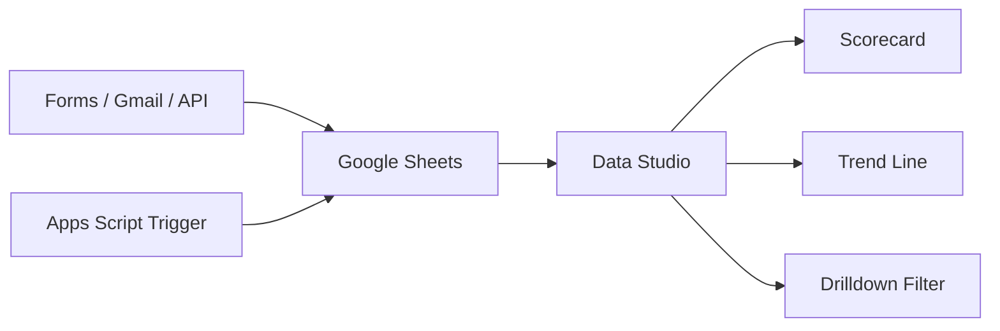

세아지주 AI 교육 > 3일 과정 > Day 1

# Google Workspace 자동화와 Agent 기획

Workspace · Apps Script · Data Studio 심화 실습을 통해 교육 후 즉시 활용 가능한 자동화 툴과 Agent 기획서를 만듭니다.

  <logos-google-gemini /> Gemini
  <logos-google-workspace /> Workspace
  <logos-google-data-studio /> Data Studio
  <carbon-flow /> 자동화 흐름

화면 상단 안내처럼 Looker Studio가 Data Studio로 변경되었습니다. 이하 장표에서는 Data Studio라고 부릅니다. 
  출처: <a href="https://cloud.google.com/blog/products/data-analytics/looker-studio-is-data-studio" target="_blank" rel="noreferrer">Google Cloud Blog, 2026-04-11</a>

---

세아지주 AI 교육 > 전체 흐름 > 3일 로드맵

# 3일 로드맵

  

    <em>Day 1</em>
    <b>Google Workspace 자동화</b>
    업무 데이터를 정리하고, 반복 처리 파이프라인을 만든 뒤, Agent로 풀 문제를 선별한다.
    
<i>Gemini</i><i>Apps Script</i><i>Data Studio</i>

    <strong>산출물: 자동화 툴 + Agent 기획서 + 프로토타입 코드</strong>
  

  

    <em>Day 2</em>
    <b>Gemini + Antigravity Agent 개발</b>
    Function Calling, RAG, Agent Loop를 이해하고 실제 부서 Painpoint 해결 Agent를 만든다.
    
<i>Gemini API</i><i>Antigravity</i><i>RAG</i>

    <strong>산출물: 동작하는 Agent 서비스</strong>
  

  

    <em>Day 3</em>
    <b>Cloud Run 배포와 Demo Day</b>
    Agent를 완성·배포하고, 팀별 시연과 확장 로드맵으로 교육 결과를 정리한다.
    
<i>Cloud Run</i><i>Antigravity</i><i>Gemini</i>

    <strong>산출물: 배포 URL + 확장 계획</strong>
  

---

세아지주 AI 교육 > Day 1 역할 > 기반 만들기

# Day 1 역할: 개발 문제 정제

  

    📥 <strong>입력</strong>
    <b>부서별 반복 업무와 문서·메일·시트 데이터</b>
    
수강생이 제출한 AX 기획 아이디어와 현장 Painpoint를 실제 업무 흐름으로 펼친다.

  

  

    ⚙️ <strong>처리</strong>
    <b>Workspace 자동화 실습</b>
    
Gemini, Apps Script, Data Studio로 바로 쓰는 자동화 산출물을 만든다.

  

  

    📤 <strong>출력</strong>
    <b>Day 2 Agent 개발 요구사항</b>
    
Agent가 필요한 일과 단순 자동화로 충분한 일을 구분해 PRD와 프로토타입 코드 방향으로 넘긴다.

  

---

세아지주 AI 교육 > Day 1 개요 > 상세 커리큘럼

# 1일차 상세 커리큘럼

Workspace · Apps Script · Data Studio 심화 실습 과정으로, 각 파트는 바로 사용할 산출물 하나를 남깁니다.

  

    <em>09:00–11:00</em>
    <b>Gemini 심화 프롬프팅 & Workspace AI 활용</b>
    <ul>
      <li>역할 기반 시스템 프롬프트와 Few-shot 패턴</li>
      <li>할루시네이션 방지용 검증 루프 프롬프트</li>
      <li>NotebookLM 사내 문서 RAG 지식 허브</li>
      <li>Sheets `=GEMINI()` 분류·요약·초안 생성</li>
      <li>Docs/Slides 보고서 초안 자동 생성</li>
    </ul>
    <strong>부서 맞춤형 Gem 세트 + Sheets AI 분석 시트</strong>
  

  

    <em>12:00–14:30</em>
    <b>Apps Script 고도화: 이벤트 기반 자동화·외부 API 연동</b>
    <ul>
      <li>onFormSubmit · 시간 기반 · onChange 트리거</li>
      <li>Form → Sheet → Gmail 자동 답신 파이프라인</li>
      <li>UrlFetchApp으로 환율·뉴스 데이터 자동 수집</li>
      <li>Drive + Calendar 일정·파일 관리 봇</li>
      <li>Logger / Webhook 기반 실패 알림</li>
    </ul>
    <strong>실제 동작하는 이메일 자동 처리 시스템</strong>
  

  

    <em>14:30–16:00</em>
    <b>Data Studio: 의사결정용 실시간 대시보드</b>
    <ul>
      <li>Sheets → Data Studio 실시간 연결</li>
      <li>스코어카드 · 트렌드 라인 · 드릴다운 필터</li>
      <li>부서별 KPI 대시보드와 공유 URL</li>
      <li>Apps Script 스케줄러 기반 자동 갱신</li>
    </ul>
    <strong>공유 가능한 KPI 대시보드 URL</strong>
  

  

    <em>16:00–17:00</em>
    <b>본사 부서 Painpoint 진단 & Agent 기획</b>
    <ul>
      <li>팀별 반복 업무와 시간 소요 지점 도출</li>
      <li>계약서 검토 · 규정 Q&A · 해외법인 보고 통합 시나리오</li>
      <li>자동화로 충분한 일과 Agent가 필요한 일 구분</li>
    </ul>
    <strong>팀별 Agent 기획서 + 프로토타입 코드</strong>
  

---

세아지주 AI 교육 > Day 1 개요 > 7시간 구조

# Day 1 시간표

  

    <b>09:00–11:00</b>
    Gemini 심화 프롬프팅 & Workspace AI 활용
    <em>Gem 세트 · 검증 루프 · NotebookLM · Sheets AI</em>
  

  

    <b>11:00–12:00</b>
    점심시간
  

  

    <b>12:00–14:30</b>
    Apps Script 고도화
    <em>트리거 · 자동 답신 · 외부 API · 실패 알림</em>
  

  

    <b>14:30–16:00</b>
    Data Studio 대시보드
    <em>실시간 연결 · KPI 화면 · 자동 갱신</em>
  

  

    <b>16:00–17:00</b>
    Painpoint 진단 & Agent 기획
    <em>팀별 Agent 기획서 + 프로토타입 코드</em>
  

---

세아지주 AI 교육 > Day 1 산출물 > 완료 기준

# Day 1 산출물

  

    🧰
    <b>이메일 자동 처리 시스템</b>
    
Form, Sheet, Gmail, Drive, Calendar를 연결한 이벤트 기반 파이프라인

  

  

    📊
    <b>KPI 대시보드 URL</b>
    
Data Studio 스코어카드, 트렌드 라인, 드릴다운 필터와 자동 갱신 구조

  

  

    🤖
    <b>Agent 기획서 + 코드 초안</b>
    
Day 2에 Gemini API와 Antigravity로 개발할 팀별 문제 정의와 프로토타입 코드 방향

  

완료 증거: 자동화 실행 결과 · 대시보드 공유 URL · Agent PRD 초안 · 프로토타입 코드 스케치

---

Day 1 > 실습 운영 > 계정 체크

# 실습 전 계정 체크

  

    <carbon-user-avatar />
    <b>Chrome 프로필</b>
    교육용 Google Workspace 계정으로 전환합니다.
  

  

    <carbon-cloud />
    <b>Drive 저장 가능</b>
    Sheets, Apps Script, NotebookLM 노트북이 저장될 수 있어야 합니다.
  

  

    <carbon-security-services />
    <b>권한 승인 경계</b>
    Gmail 발송, Calendar와 Drive 권한 승인, 외부 공유는 권한 안내 화면의 범위를 확인한 뒤 진행합니다.
  

  

    <carbon-data-table />
    <b>샘플 데이터만 사용</b>
    장표의 합성 데이터로 실습하고 실제 고객·계약·인사 정보는 넣지 않습니다.
  

---

Day 1 > 실습 운영 > 공통 시나리오

# 오늘의 실습 서사: 공용 요청함 자동화

이후 모든 도구는 “앱 사용법”이 아니라, 누구나 겪는 고객·내부 요청을 접수하고 처리하는 하나의 흐름으로 연결합니다.

  

    01
    <h3><simple-icons-googleforms /> 접수</h3>
    
Form 또는 Gmail로 요청이 들어온다.

  

  

    02
    <h3><logos-google-gemini /> 분류</h3>
    
Gemini가 유형·긴급도·확인 질문을 만든다.

  

  

    03
    <h3><logos-google-icon /> 근거</h3>
    
NotebookLM이 규정 소스에서 답변 근거를 찾는다.

  

  

    04
    <h3><simple-icons-googleappsscript /> 실행</h3>
    
Apps Script가 초안·일정·파일 링크를 준비한다.

  

완료 모습: 요청 목록 Sheet · Gmail 초안 · Calendar/Drive 후속 조치 · Data Studio 처리 현황 대시보드

---

Day 1 > 실습 운영 > 샘플 데이터

# 합성 요청 데이터셋

실제 회사 데이터 대신 아래 6건의 가상 요청으로 모든 실습을 이어갑니다.

  
<b>REQ-001</b>IT지원<em>VPN 접속 오류 · 오늘 오후 고객 미팅</em>

  
<b>REQ-002</b>구매<em>팀 공용 모니터 2대 구매 가능 여부</em>

  
<b>REQ-003</b>인사총무<em>은행 제출용 재직증명서 발급 요청</em>

  
<b>REQ-004</b>회계<em>거래처 세금계산서 재발행 문의</em>

  
<b>REQ-005</b>일정<em>신규 입사자 OT 일정 조율</em>

  
<b>REQ-006</b>Drive<em>프로젝트 자료 폴더 공유 요청</em>

이 데이터는 Gemini 프롬프트, NotebookLM 규정 확인, Sheets 표, Apps Script 자동화, 대시보드까지 그대로 재사용합니다.

---
layout: section
---

Day 1 > Part 1 > Gemini와 Workspace

# Gemini 심화 프롬프팅 & Workspace AI 활용

09:00–11:00 · 역할 기반 프롬프트, 검증 루프, NotebookLM, Sheets AI를 묶어 부서 맞춤형 Gem 세트와 분석 시트를 만든다.

---

Day 1 > Gemini와 Workspace > 도구 소개

# Gemini 서비스 화면

  

    <PublicImage src="screenshots/gemini-page.png" alt="Gemini public service page screenshot" />
  

  

    <simple-icons-googlegemini />
    <b>Gemini</b>
    질문 입력창, 모델 선택, 도구 호출이 한 화면에 있는 범용 AI assistant입니다. ex) GPT(OpenAI), Claude(Anthropic) 
     오늘은 이 대화형 사용법을 Workspace 데이터 처리로 확장합니다.
    <small>출처: <a href="https://gemini.google.com/">gemini.google.com 공개 화면</a> 캡처</small>
  

---

Day 1 > Gemini와 Workspace > 모델 선택

# Gemini 모델과 사고 수준 선택

  <figure class="model-menu-shot">
    <PublicImage src="screenshots/gemini-model-thinking-menu.png" alt="Gemini model picker and thinking level menu" />
    <figcaption>실습 화면: 모델 선택 메뉴와 사고 수준(Standard/Extended)</figcaption>
  </figure>
  

    

      
<b>3.1 Flash-Lite</b>가벼운 반복 작업, 빠른 초안, 대량 처리

      
<b>3.5 Flash</b>일상 업무 질의와 추론의 균형

      
<b>3.1 Pro</b>복잡한 수학·코딩·긴 문서 분석

    

    

      <h3><carbon-decision-tree /> 사고 수준은 속도와 추론 깊이의 조절 장치</h3>
      
<b>Standard</b>는 대부분의 질문에 적합한 기본값입니다.  <b>Extended</b>는 복잡한 문제 해결, 다단계 계획, 코드 검증처럼 더 깊은 추론이 필요한 때 선택합니다.

    

  

근거: <a href="https://support.google.com/gemini/answer/13275745?co=GENIE.Platform%3DDesktop&hl=nl">Gemini Apps Help: 모델 전환과 Flash-Lite/Flash/Pro 설명</a> · <a href="https://docs.cloud.google.com/vertex-ai/generative-ai/docs/thinking">Google Cloud: Gemini thinking levels</a> · <a href="https://blog.google/innovation-and-ai/models-and-research/gemini-models/gemini-3-1-pro/">Google Blog: Gemini 3.1 Pro</a>

---

Day 1 > Gemini와 Workspace > 도구 소개

# Google Workspace

  <figure class="workspace-image-card">
    
    <figcaption>이미지 출처: Flow Team Blog, 2025-06-04</figcaption>
  </figure>
  

    <h3><logos-google-workspace /> 하나의 계정으로 연결되는 업무 생태계</h3>
    
Google Workspace는 메일 하나가 아니라 커뮤니케이션, 일정, 파일 저장, 공동 편집, 설문, 사이트, AI 보조 기능이 한 계정과 권한 체계 안에서 움직이는 클라우드 협업 플랫폼입니다.

    

      <logos-google-gmail /> Gmail
      <logos-google-calendar /> Calendar
      <logos-google-meet /> Meet
      <simple-icons-googlechat /> Chat
      <logos-google-drive /> Drive
      <simple-icons-googledocs /> Docs
      <simple-icons-googlesheets /> Sheets
      <simple-icons-googleslides /> Slides
      <simple-icons-googleforms /> Forms
      <simple-icons-googleappsscript /> Apps Script
      <logos-google-gemini /> Gemini
      <logos-google-data-studio /> Data Studio
    

  

참고: <a href="https://platform.flow.team/blog/gws-purpose">Flow Team Blog: 구글 워크스페이스로 팀워크 혁신</a> · <a href="https://workspace.google.com/">Google Workspace 공식 소개</a>

---

Day 1 > Gemini와 Workspace > 처리 흐름

# Workspace AI 처리 흐름

  

    <h3>업무 신호</h3>
    

      <logos-google-gmail />메일
      <simple-icons-googleforms />신청
      <simple-icons-googledocs />문서
      <logos-google-drive />파일
      <logos-google-calendar />일정
    

  

  
<carbon-arrow-right />

  

    <h3><logos-google-gemini /> Gemini 판단</h3>
    
분류 · 요약 · 확인 질문 · 근거 추출

    <strong>“어떤 업무인가?” → “누가 무엇을 해야 하나?”</strong>
  

  
<carbon-arrow-right />

  

    <h3>실행과 공유</h3>
    

      <simple-icons-googlesheets />Sheets 기록
      <logos-google-gmail />Gmail 초안
      <simple-icons-googleslides />Slides 보고
      <logos-google-data-studio />Data Studio
      <simple-icons-googleappsscript />Apps Script
    

  

핵심은 “앱 하나 사용법”이 아니라, Workspace 앱들이 같은 계정·권한·파일을 공유하며 AI 처리 파이프라인을 만든다는 점입니다.

---

Day 1 > Gemini와 Workspace > 프롬프트 개념

# 프롬프트 기본 개념

  

    <carbon-chat />
    

      <b>프롬프트 = AI에게 맡길 업무 지시서</b>
      
역할, 입력 데이터, 판단 기준, 출력 형식, 금지 조건, 검증 기준을 한 번에 적어 AI가 같은 방식으로 반복 처리하게 만드는 작업 명세입니다.

    

  

  

    

      <em>Tip 1</em>
      <b>업무형 프롬프트는 기준을 먼저 준다</b>
      “잘 요약해줘”보다 “요청 유형·긴급도·담당 부서 기준으로 분류하고, 판단 근거를 같이 남겨줘”처럼 업무 규칙을 명시합니다.
    

    

      <em>Tip 2</em>
      <b>완료 기준은 검토 가능해야 한다</b>
      최종 답변뿐 아니라 표 구조, 근거 문장, 확인 질문, 재사용 가능한 출력 형식이 남아야 팀 업무에 붙일 수 있습니다.
    

  

---

Day 1 > Gemini와 Workspace > Gem 세트 1/4

# Gem 요소 1: 역할

  

    <em>Role</em>
    <b>역할은 “누구처럼 말할지”가 아니라 “어떤 책임으로 판단할지”를 고정합니다.</b>
    
부서, 업무 권한, 검토 범위, 최종 결정권의 유무가 들어가야 같은 요청을 반복 처리할 수 있습니다.

  

  

    

      <h3>아쉬운 예시</h3>
      <pre class="gem-code"><code>너는 친절한 HR 전문가야.&#10;직원 질문에 잘 답해줘.</code></pre>
      문제: 부서 기준, 답변 권한, 승인 경계가 없어 민감한 규정도 확정 답변처럼 말할 수 있습니다.
    

    

      <h3>좋은 예시</h3>
      <pre class="gem-code"><code>너는 세아지주 본사 HR 운영팀의&#10;1차 규정 안내 담당자다.&#10;&#10;휴가·복리후생 질문에 답하되,&#10;해석이 필요한 사안은&#10;“HR 담당자 확인 필요”로 표시한다.</code></pre>
      포인트: 담당 부서, 업무 범위, 권한 경계를 함께 지정합니다.
    

  

---

Day 1 > Gemini와 Workspace > Gem 세트 2/4

# Gem 요소 2: 업무 기준

  

    <em>Policy</em>
    <b>업무 기준은 AI가 임의로 판단하지 않도록 만드는 분류표입니다.</b>
    
유형, 긴급도, 금지 표현, 승인 조건, 조직 용어를 명시하면 부서마다 다른 판단 기준을 재사용할 수 있습니다.

  

  

    

      <h3>아쉬운 예시</h3>
      <pre class="gem-code"><code>메일을 읽고 중요하면&#10;긴급으로 표시해줘.</code></pre>
      문제: “중요”와 “긴급”의 기준이 없어 사람마다 결과가 달라집니다.
    

    

      <h3>좋은 예시</h3>
      <pre class="gem-code"><code>긴급도는 다음 기준으로 분류한다.&#10;- 높음: D-1 이내 마감, 임원 요청, 법적 리스크&#10;- 중간: 3영업일 내 확인&#10;- 낮음: 참고 공유&#10;&#10;유형은 계약·정산·인사·기타 중&#10;하나만 선택한다.</code></pre>
      포인트: 판단 기준을 표준화하고 선택지를 제한합니다.
    

  

---

Day 1 > Gemini와 Workspace > Gem 세트 3/4

# Gem 요소 3: 출력 형식

  

    <em>Output</em>
    <b>출력 형식은 결과를 Sheets, Gmail, 보고서로 바로 옮기기 위한 인터페이스입니다.</b>
    
항목명, 순서, 빈 값 처리, 근거 표시 방식을 고정해야 자동화와 검토가 쉬워집니다.

  

  

    

      <h3>아쉬운 예시</h3>
      <pre class="gem-code"><code>요약해서&#10;답장 초안을 만들어줘.</code></pre>
      문제: 매번 문장 길이와 항목 순서가 바뀌어 시트나 자동화에 붙이기 어렵습니다.
    

    

      <h3>좋은 예시</h3>
      <pre class="gem-code"><code>JSON으로 출력한다.&#10;{&#10;  "유형": "",&#10;  "긴급도": "",&#10;  "담당부서": "",&#10;  "3줄요약": [],&#10;  "근거문장": "",&#10;  "확인질문": "",&#10;  "답장초안": ""&#10;}&#10;&#10;모르면 빈칸이 아니라&#10;“확인 필요”라고 적는다.</code></pre>
      포인트: 기계가 읽을 수 있는 구조와 예외 처리를 함께 정합니다.
    

  

---

Day 1 > Gemini와 Workspace > Gem 세트 4/4

# Gem 요소 4: 검증

  

    <em>Check</em>
    <b>검증은 답을 더 길게 만드는 단계가 아니라 위험한 확정을 막는 안전장치입니다.</b>
    
근거 없는 추정, 민감정보, 외부 발송, 권한 승인 지점을 분리해 사람이 확인할 수 있게 합니다.

  

  

    

      <h3>아쉬운 예시</h3>
      <pre class="gem-code"><code>확실하게 답변하고&#10;바로 메일로 보내줘.</code></pre>
      문제: 근거 부족, 개인정보, 승인 필요 여부를 건너뛰고 실행할 수 있습니다.
    

    

      <h3>좋은 예시</h3>
      <pre class="gem-code"><code>근거 문장이 없으면&#10;“확인 필요”로 표시한다.&#10;&#10;개인정보·계약·인사 조치가 포함되면&#10;발송하지 말고 승인자와 확인 질문을&#10;먼저 제시한다.</code></pre>
      포인트: 자동화 전에 멈춰야 할 조건을 Gem에 포함합니다.
    

  

실습 포인트: 개인 채팅 프롬프트가 아니라 팀에서 반복해서 쓰는 업무 프롬프트 세트를 만든다.

---

Day 1 > Gemini와 Workspace > Few-shot 패턴

# Few-shot · 단계별 검토 패턴

  

    <b>Few-shot</b>
    
좋은 입력과 좋은 출력 예시를 2~3개 넣어, Gemini가 분류 기준과 문체를 따라오게 한다.

  

  

    <b>단계별 검토</b>
    
내부 추론을 길게 요구하기보다 `확인한 근거`, `불확실한 항목`, `다음 질문`을 분리해 달라고 요청한다.

  

  

    <b>업무 적용</b>
    
공용 요청을 IT지원·구매·인사총무·회계·고객문의·기타로 분류하고, 담당 후보와 답장 초안을 표준 형식으로 남긴다.

  

<CopyBlock>
[예시 1] VPN 접속 오류 → IT지원 / 긴급도 높음 / 오류 화면 확인 필요
[예시 2] 모니터 구매 문의 → 구매 / 긴급도 중간 / 수량·예산 확인 필요
아래 신규 요청도 같은 기준으로 분류하고, 근거와 확인 질문을 함께 작성해 주세요.
</CopyBlock>

---

Day 1 > Gemini와 Workspace > 역할 기반 프롬프트

# 프롬프트 설계: Role · Context · Check

  

    <b>🎭 Role</b>
    “회사 공용 요청함의 1차 분류 담당자”처럼 실습 역할을 명확히 지정한다.
  

  

    <b>📎 Context</b>
    요청ID, 채널, 제목, 본문, 희망기한, 처리 제외 조건을 함께 제공한다.
  

  

    <b>✅ Check</b>
    근거, 확인 질문, 발송 전 사람 승인 필요 여부를 결과에 포함시킨다.
  

<CopyBlock>
당신은 회사 공용 요청함의 1차 분류 담당자입니다.
아래 요청을 업무 유형, 긴급도, 담당 후보, 확인 질문으로 나누어 주세요.
근거가 부족한 내용은 "확인 필요"로 표시하고, 처리 확정처럼 쓰지 마세요.
</CopyBlock>

---

Day 1 > Gemini와 Workspace > Gemini 실습

# Gemini 실습 1-1: 입력창까지 이동

  

    <PublicImage src="walkthroughs/gemini-home.png" alt="Gemini prompt input walkthrough" />
  

  

    <h3><logos-google-gemini /> 버튼 순서</h3>
    

      브라우저 주소창에 <b>gemini.google.com</b> 입력
      로그인이 필요하면 교육용 계정으로 로그인
      하단 <b>Gemini 프롬프트 입력</b> 영역 클릭
      모델 선택은 기본 <b>Flash</b> 상태로 둠
    

    
여기서는 아직 전송하지 않습니다. 다음 장에서 프롬프트를 복사해 한 번에 붙여넣습니다.

  

---

Day 1 > Gemini와 Workspace > Gemini 실습

# Gemini 실습 1-2: 요청 분류 프롬프트 실행

  

    <h3><carbon-play /> 실행 순서</h3>
    

      아래 프롬프트를 <b>복사</b>
      Gemini 입력창에 붙여넣기
      전송 버튼 클릭
      표에 <b>분류·긴급도·담당 후보·근거·확인 질문</b>이 모두 있는지 확인
    

  

  <CopyBlock class="compact" text-key="geminiRequestPrompt" />

완료 증거: REQ-001이 IT지원/긴급 요청으로 분류되고, 확정 답변 대신 추가 확인 질문이 남습니다.

---

Day 1 > Gemini와 Workspace > 할루시네이션 방지

# 검증 루프 기본 개념

  

    <carbon-search />
    <b>검증 루프</b>
    AI 답변을 그대로 쓰지 않고, 근거·반례·사람 승인을 거쳐 업무 결과로 확정하는 반복 절차
  

  

    <carbon-warning />
    <b>필요한 이유</b>
    할루시네이션, 오래된 정보, 누락 조건, 권한 밖 판단을 업무 발송 전에 걸러낸다.
  

  

    <carbon-loop />
    <b>실무 기준</b>
    자동 생성보다 자동 검토 지점을 먼저 설계해야 운영 가능한 자동화가 된다.
  

---

Day 1 > Gemini와 Workspace > 할루시네이션 방지

# 검증 루프: 근거 · 반례 · 승인

  
<em>1</em><b>답변 생성</b>Gemini가 요약, 분류, 초안을 만든다.

  
<em>2</em><b>근거 표시</b>셀 주소, 문서 섹션, 메일 제목을 함께 남긴다.

  
<em>3</em><b>반례 질문</b>누락 조건과 충돌 데이터를 다시 묻는다.

  
<em>4</em><b>사람 승인</b>발송·공유 전 최종 판단 지점을 둔다.

실습에서는 “정답 요청”보다 “근거와 불확실성을 남기는 요청”을 표준 패턴으로 씁니다.

---

Day 1 > Gemini와 Workspace > Gemini 실습

# Gemini 실습 1 결과 확인

  

    <PublicImage src="walkthroughs/gemini-result.png" alt="Gemini response table walkthrough" />
  

  

    <h3><carbon-checkmark-outline /> 확인할 항목</h3>
    

      REQ-001이 IT지원 또는 장애 요청으로 분류되는가
      긴급도와 판단 근거가 분리되어 있는가
      사용 기기·오류 화면 같은 확인 질문이 남는가
      답장 초안에 과도한 확정 표현이 없는가
    

  

---

Day 1 > Gemini와 Workspace > NotebookLM

# NotebookLM: 소스 기반 AI 노트북

  

    <logos-google-icon />
    

      <b>내 문서 묶음과 대화하는 Google AI 연구·학습 도구</b>
      
NotebookLM은 PDF, 웹사이트, YouTube, 오디오, Google Docs/Slides 등 사용자가 넣은 자료를 하나의 노트북으로 묶고, 그 소스를 기반으로 질문·요약·학습 자료 생성을 돕는 서비스입니다.

    

  

  

    <em><carbon-document-attachment /> Source Grounding</em>
    
답변을 일반 웹 검색 지식이 아니라 <b>선택한 소스</b>에 연결하고, 인라인 citation으로 근거 문장 위치를 다시 확인하게 만드는 방식입니다.

  

  <small class="day2-link">작게 연결: Day 2에서는 이 “소스 묶음 + 질문 목록”을 RAG Agent의 지식 베이스 후보로 바꿔 봅니다.</small>

근거: <a href="https://support.google.com/notebooklm/answer/16164461?hl=en">NotebookLM Help: Learn about NotebookLM</a> · <a href="https://support.google.com/notebooklm/answer/16179559?hl=en">NotebookLM Help: Use chat and citations</a>

---

Day 1 > Gemini와 Workspace > NotebookLM

# NotebookLM 화면 구조

Sources · Chat · Studio 3개 패널로 소스를 넣고, 근거 기반으로 묻고, 산출물을 만듭니다.

  <figure class="notebook-ui-shot">
    <PublicImage src="screenshots/notebooklm-three-panel.png" alt="NotebookLM three panel UI with Sources, Chat, Studio" />
  </figure>
  

    

      <h3><carbon-folder /> Sources</h3>
      
왼쪽 패널에서 파일·웹·Drive 자료를 추가하고, 체크박스로 이번 질문에 사용할 소스만 선택합니다. 소스는 노트북의 “근거 데이터”입니다.

    

    

      <h3><carbon-chat /> Chat</h3>
      
가운데 패널에서 소스 요약을 보고 질문합니다. 답변은 직접 인용·텍스트·이미지 citation으로 연결되어 원문 위치를 확인할 수 있습니다.

    

    

      <h3><carbon-microphone /> Studio</h3>
      
오른쪽 패널은 소스 기반 산출물 제작 공간입니다. Audio Overview, Study guide, Briefing doc, FAQ, Timeline 같은 자료를 생성합니다.

    

  

근거: <a href="https://support.google.com/notebooklm/answer/16215270?co=GENIE.Platform%3DDesktop&hl=en">Sources 도움말</a> · <a href="https://support.google.com/notebooklm/answer/16179559?hl=en">Chat/citation 도움말</a> · <a href="https://support.google.com/notebooklm/answer/16206563?hl=en">Studio 패널 도움말</a> · <a href="https://support.google.com/notebooklm/answer/16212820?hl=en">Audio Overview 도움말</a>

---

Day 1 > Gemini와 Workspace > NotebookLM 활용

# NotebookLM 활용 반응

  

    <b>🗂️ 소스 묶음</b>
    Google은 NotebookLM을 “사용자가 가진 소스에 근거한 research assistant”로 설명합니다.
    <small><a href="https://support.google.com/notebooklm/answer/16215270?co=GENIE.Platform%3DDesktop&hl=en">NotebookLM Help: sources</a></small>
  

  

    <b>💬 실제 사용법</b>
    최근 문서 10개를 한 노트북에 넣고 질문해보는 방식, 프로젝트별 노트북 운영 방식이 소개됩니다.
    <small><a href="https://support.google.com/notebooklm/answer/16215270?co=GENIE.Platform%3DDesktop&hl=en">NotebookLM Help: web/Drive sources</a></small>
  

  

    <b>🎧 사용자 반응</b>
    Audio Overviews는 업로드한 소스의 핵심 주제를 AI hosts가 토론형 요약으로 풀어주며, 80개 이상 언어 생성을 지원합니다.
    <small><a href="https://support.google.com/notebooklm/answer/16212820?hl=en">NotebookLM Help: Audio Overview</a></small>
  

---

Day 1 > Gemini와 Workspace > NotebookLM 실습

# NotebookLM 실습 3-1: 소스 추가 창 열기

  

    <PublicImage src="walkthroughs/notebooklm-source-dialog.png" alt="NotebookLM copied text source dialog walkthrough" />
  

  

    <h3><carbon-document /> 버튼 순서</h3>
    

      <b>notebooklm.google.com</b> 접속
      <b>새 노트북</b> 또는 <b>Create new</b> 클릭
      소스 추가 창에서 <b>Copied text</b> 선택
      제목을 <b>요청 처리 규정 샘플</b>로 입력
    

    
NotebookLM은 넣은 소스에 근거해 답합니다. 아직 답을 묻지 말고 소스부터 고정합니다.

  

---

Day 1 > Gemini와 Workspace > NotebookLM 실습

# NotebookLM 실습 3-2: 규정 샘플 붙여넣기

  

    <h3><carbon-paste /> 붙여넣기 순서</h3>
    

      아래 규정 샘플을 <b>복사</b>
      Copied text 본문 영역에 붙여넣기
      <b>Insert</b> 클릭
      왼쪽 Sources에 소스 1개가 생겼는지 확인
    

  

  <CopyBlock class="compact" text-key="notebookPolicySource" />

---

Day 1 > Gemini와 Workspace > NotebookLM 실습

# NotebookLM 실습 3-3: 소스 요약 확인

  

    <PublicImage src="walkthroughs/notebooklm-summary.png" alt="NotebookLM source summary walkthrough" />
  

  

    <h3><carbon-search-locate /> 확인할 위치</h3>
    

      왼쪽 Sources에서 방금 넣은 소스가 체크되어 있는지 확인
      가운데 Summary가 규정 항목을 요약하는지 확인
      Chat 입력창 위치를 확인
      다음 장에서 질문을 붙여넣음
    

    
완료 증거: 답변을 묻기 전에 “어떤 소스를 근거로 답할지”가 화면에 보입니다.

  

---

Day 1 > Gemini와 Workspace > NotebookLM 실습

# NotebookLM 실습 3-4: 근거 질문하기

  

    <h3><carbon-chat /> 질문 순서</h3>
    

      Chat 입력창 클릭
      아래 질문 3개 붙여넣기
      응답 안의 citation 또는 근거 표시 확인
      정책에 없는 내용은 “확인 필요”로 표시되는지 확인
    

  

  <CopyBlock class="compact" text-key="notebookQuestions" />

---

Day 1 > Gemini와 Workspace > Sheets AI

# Google Sheets AI 기본 개념

  

    <logos-google-drive />
    <b>Google Sheets</b>
    행과 열로 업무 데이터를 정리하고, 계산·필터·공유·자동화를 붙이는 스프레드시트 도구
  

  

    <logos-google-gemini />
    <b>Sheets AI</b>
    셀 범위의 문맥을 읽어 분류, 요약, 초안 작성, 항목 추출을 표 작업 안에서 수행한다.
  

  

    <carbon-data-table />
    <b>실습 관점</b>
    메일·요청·보고 데이터를 행 단위로 넣고, Gemini 처리 열을 추가해 운영 가능한 시트를 만든다.
  

---

Day 1 > Gemini와 Workspace > Sheets AI

# Sheets AI: 분류 · 요약 · 초안 생성

  

    <h3><logos-google-gmail /> 메일 원문</h3>
    
제목, 본문, 발신자, 요청 마감일을 행 단위로 정리한다.

    
rawrequestowner

  

  

    <h3><logos-google-gemini /> Gemini 처리 열</h3>
    
유형, 긴급도, 요약, 답장 초안, 확인 필요 항목을 자동 생성한다.

    
classifysummarizedraft

  

<CopyBlock class="compact">
=AI("이 요청을 IT지원/구매/인사총무/회계/고객문의/기타로 분류하고, 담당자 후보와 답장 초안을 작성해줘", A2:F2)
</CopyBlock>

Google Docs Editors Help는 Sheets AI 함수에서 <code>=AI()</code> 또는 <code>=GEMINI()</code>를 사용할 수 있다고 안내합니다. 단, eligible Workspace/Google AI plan과 관리자 설정에 따라 보이지 않을 수 있습니다.

---

Day 1 > Gemini와 Workspace > Sheets 실습

# Sheets 실습 2-1: 빈 Sheet 열기

  

    <PublicImage src="walkthroughs/sheets-blank.png" alt="Google Sheets blank sheet walkthrough" />
  

  

    <h3><carbon-table-split /> 버튼 순서</h3>
    

      <b>sheets.new</b> 접속
      새 스프레드시트가 열리면 <b>A1</b> 셀 클릭
      행/열이 비어 있는지 확인
      다음 장의 TSV를 A1에 붙여넣음
    

    
TSV는 탭으로 구분된 표 텍스트입니다. A1에 붙여넣으면 여러 열로 자동 분리됩니다.

  

---

Day 1 > Gemini와 Workspace > Sheets 실습

# Sheets 실습 2-2: 요청 데이터 붙여넣기

  

    <h3><carbon-paste /> 붙여넣기 순서</h3>
    

      아래 TSV 전체 복사
      Sheet의 <b>A1</b>에 붙여넣기
      REQ-001~REQ-006까지 6행이 보이는지 확인
      분류·긴급도·담당후보 열은 Gemini 결과로 채움
    

  

  <CopyBlock class="compact" text-key="sheetRequestTsv" />

---

Day 1 > Gemini와 Workspace > Docs와 Slides

# 보고서 초안 구조화

  

    <b>🧱 목차 생성</b>
    목적, 현황, 이슈, 의사결정 요청으로 보고 구조를 고정한다.
  

  

    <b>📝 본문 초안</b>
    시트 요약과 근거 링크를 문단으로 변환한다.
  

  

    <b>🎯 임원용 요약</b>
    3줄 요약, 의사결정 포인트, 리스크만 앞에 배치한다.
  

  

    <b>📎 근거 링크</b>
    원본 문서, 시트, 메일 링크를 남겨 검토 흐름을 유지한다.
  

---

Day 1 > Gemini와 Workspace > 실습 산출물

# Part 1 실습 안내

  
<em>목표</em><b>Gemini로 업무 요청 데이터를 읽고 처리 기준을 만든다.</b>

  
<em>시작 화면</em><b>Gemini · NotebookLM · Google Sheets</b>

  
<em>수행</em><b>프롬프트 3종 작성 → 시트 분류/요약 → NotebookLM 질문 목록 정리</b>

  
<em>완료 증거</em><b>Gem 세트, Sheets AI 분석 시트, RAG 후보 질문 목록</b>

---

Day 1 > Gemini와 Workspace > 실습 산출물

# Part 1 체크리스트

  

    ✅
    <b>부서 맞춤형 Gem 세트</b>
    
역할 기반 시스템 프롬프트, Few-shot 예시, 검증 루프 프롬프트

  

  

    ✅
    <b>Sheets AI 분석 시트</b>
    
Sheets AI 함수로 요청을 분류·요약하고 답장 초안을 만든다.

  

  

    ✅
    <b>NotebookLM + 보고서 초안</b>
    
사내 문서 RAG 질문 목록과 Docs/Slides 보고서 초안 구조를 정리한다.

  

---
layout: section
---

Day 1 > Part 2 > Apps Script

# Apps Script 고도화: 이벤트 기반 자동화와 API 연동

12:00–14:30 · 트리거, 자동 답신, 외부 API 수집, Drive/Calendar 봇, 실패 알림까지 실제 동작하는 자동 처리 시스템을 만든다.

---

Day 1 > Apps Script > 실습 안내

# Apps Script 실습 안내

  
<em>목표</em><b>이벤트가 발생하면 Workspace 앱이 자동으로 움직이게 만든다.</b>

  
<em>시작 화면</em><b>Google Form · Sheet · Apps Script 편집기</b>

  
<em>수행</em><b>트리거 설정 → Gmail 답신 → API 수집 → Drive/Calendar 연동 → 실패 알림</b>

  
<em>완료 증거</em><b>메일 발송 로그, 시트 기록, Slack/Webhook 실패 알림 테스트</b>

---

Day 1 > Apps Script > 서비스 소개

# 요청 자동화에 쓰는 Workspace 서비스

  

    <simple-icons-googleforms />
    <b>Google Forms</b>
    반복되는 신청·문의·요청을 같은 질문 구조로 받는 접수 화면입니다.
  

  

    <logos-google-gmail />
    <b>Gmail</b>
    요청자에게 접수 확인, 추가 질문, 처리 결과를 보내는 커뮤니케이션 채널입니다.
  

  

    <logos-google-calendar />
    <b>Calendar</b>
    검토 마감, 미팅, 후속 조치 시간을 팀 일정으로 남기는 도구입니다.
  

  

    <logos-google-drive />
    <b>Drive</b>
    요청별 증빙 파일과 산출물을 폴더·링크·권한으로 관리하는 저장소입니다.
  

안전 경계: 실습은 Gmail <code>createDraft</code>와 로그 실행을 기본으로 하며, 실제 발송·외부 공유는 강사 안내 후 진행합니다.

---

Day 1 > Apps Script > Forms 준비

# Forms 실습: 요청 접수 화면 만들기

  

    <PublicImage src="walkthroughs/request-intake-forms.png" alt="Synthetic Google Forms request-intake walkthrough with bbox overlays" />
  

  

    <h3><simple-icons-googleforms /> 버튼 순서</h3>
    

      <b>forms.new</b> 접속
      제목을 <b>공용 요청 접수</b>로 입력
      <b>+</b> 버튼으로 아래 6개 질문 추가
      <b>응답</b> 탭 → 초록 Sheets 아이콘 클릭
    

    
완료 증거: 응답이 쌓일 Sheet가 생성되고, 이후 Apps Script가 그 Sheet를 읽습니다.

  

  요청자 이메일요청 제목요청 유형
  요청 내용희망 처리 기한첨부/Drive 링크

---

Day 1 > Apps Script > 실습 준비

# Apps Script 실습 4-1: 편집기 열기

  

    <PublicImage src="walkthroughs/appscript-editor.png" alt="Apps Script editor walkthrough" />
  

  

    <h3><carbon-script /> 버튼 순서</h3>
    

      요청 Sheet 메뉴에서 <b>Extensions</b> 클릭
      <b>Apps Script</b> 클릭
      <b>Code.gs</b> 파일이 열린 것을 확인
      기존 샘플 코드가 있으면 전체 선택 후 삭제
    

    
먼저 권한이 필요 없는 로그 함수로 편집기·실행·로그 위치를 익힙니다.

  

---

Day 1 > Apps Script > 실습 준비

# Apps Script 실습 4-2: 로그 코드 붙여넣기

  

    <h3><carbon-paste /> 붙여넣기 순서</h3>
    

      아래 코드를 복사
      <b>Code.gs</b>에 붙여넣기
      <b>Save</b> 또는 <kbd>⌘S</kbd> 저장
      함수 드롭다운에 <b>classifyRequestSample</b>가 보이는지 확인
    

  

  <CopyBlock class="compact" text-key="appScriptLogSample" />

---

Day 1 > Apps Script > 실습 준비

# Apps Script 실습 4-3: Run과 로그 확인

  

    <PublicImage src="walkthroughs/appscript-run-log.png" alt="Apps Script run log walkthrough" />
  

  

    <h3><carbon-checkmark-outline /> 확인 순서</h3>
    

      함수 드롭다운에서 <b>classifyRequestSample</b> 선택
      <b>Run</b> 클릭
      하단 Execution log 열기
      REQ-001의 category·urgency·evidence가 JSON으로 보이는지 확인
    

    
권한 승인이 필요한 Gmail/Drive 작업 전에 실행 로그와 JSON 출력 구조부터 확인합니다.

  

---

Day 1 > Apps Script > 자동화 관점

# Apps Script: Workspace 접착제

  <b>트리거가 이벤트를 감지하고, 스크립트가 판단하며, Workspace 앱이 결과를 실행한다.</b>
  수작업으로 반복하던 “확인 → 복사 → 발송 → 기록”을 하나의 운영 흐름으로 묶는다.

  <logos-google-gsuite /> Forms
  <logos-google-drive /> Drive
  <logos-google-gmail /> Gmail
  <logos-google-calendar /> Calendar
  <carbon-api /> External API

---

Day 1 > Apps Script > 트리거 설계

# 트리거 설계: 실행 순간

  

    <carbon-event />
    <b>onFormSubmit</b>
    신청, 문의, 요청이 들어오는 즉시 후속 처리를 시작한다.
  

  

    <carbon-time />
    <b>시간 기반</b>
    매일 오전 9시, 매주 월요일처럼 정해진 주기로 API 수집과 대시보드 갱신을 실행한다.
  

  

    <carbon-data-table />
    <b>onChange</b>
    시트 구조나 데이터 변경을 감지해 집계·알림을 갱신한다.
  

---

Day 1 > Apps Script > 실습 1

# Form → Sheet → Gmail 초안 흐름

  
<logos-google-gsuite /><b>Form 제출</b>요청 접수

  
<carbon-arrow-right />

  
<logos-google-drive /><b>Sheet 기록</b>담당/유형 분류

  
<carbon-arrow-right />

  
<logos-google-gmail /><b>Gmail 초안</b>확인 메일 작성

  
<em>왜 초안인가</em><b>실습 안전을 위해 실제 발송하지 않음</b>

  
<em>확인 위치</em><b>Gmail Drafts에서 제목·본문 확인</b>

  
<em>확장</em><b>승인 후에만 sendEmail로 변경</b>

  
<em>기록</em><b>Sheet 행 번호와 draft 생성 시간을 로그로 남김</b>

---

Day 1 > Apps Script > 실습 1

# Gmail 초안 생성 코드 붙여넣기

  

    <h3><logos-google-gmail /> 실행 순서</h3>
    

      Apps Script 편집기에서 새 함수 붙여넣기
      실습 중에는 <b>createDraft</b>만 사용
      Run 후 권한 승인 화면이 나오면 강사 안내에 따라 진행
      Gmail Drafts에서 실제 발송 전 내용을 검토
    

  

  <CopyBlock class="compact" text-key="appScriptDraftPipeline" />

실습 기본값은 발송이 아니라 Gmail 초안 생성입니다. 실제 발송이 필요한 경우 <code>createDraft</code>를 <code>sendEmail</code>로 바꿉니다.

---

Day 1 > Apps Script > 실습 1

# Gmail Drafts에서 초안 확인

  

    <PublicImage src="walkthroughs/request-intake-gmail-draft.png" alt="Synthetic Gmail draft walkthrough with bbox overlays" />
  

  

    <h3><logos-google-gmail /> 확인 순서</h3>
    

      Gmail 왼쪽 메뉴에서 <b>Drafts/임시보관함</b> 클릭
      제목이 <b>[접수 완료]</b>로 시작하는 초안 열기
      수신자·제목·본문이 요청 행과 맞는지 확인
      <b>Send</b>는 누르지 않고 창을 닫기
    

    
실습 목표는 자동 발송이 아니라 사람이 검토할 수 있는 초안을 만드는 것입니다.

  

---

Day 1 > Apps Script > Calendar·Drive 후속 조치

# Calendar: 후속 미팅 초안 만들기

  

    <PublicImage src="walkthroughs/request-intake-calendar.png" alt="Synthetic Calendar event walkthrough with bbox overlays" />
  

  

    <h3><logos-google-calendar /> 버튼 순서</h3>
    

      Calendar에서 <b>Create</b> 클릭
      제목에 <b>REQ-005 신규 입사자 OT</b> 입력
      일시와 참석자를 요청 내용대로 채움
      교육용 계정에서만 Save, 일반 실습은 초안 확인 후 닫기
    

    
요청 처리 자동화에서 Calendar는 “후속 조치 시간”을 놓치지 않게 만드는 장치입니다.

  

---

Day 1 > Apps Script > Calendar·Drive 후속 조치

# Drive: 요청별 폴더와 공유 경계 확인

  

    <PublicImage src="walkthroughs/request-intake-drive.png" alt="Synthetic Drive folder sharing walkthrough with bbox overlays" />
  

  

    <h3><logos-google-drive /> 버튼 순서</h3>
    

      Drive에서 <b>New > Folder</b> 클릭
      폴더명을 <b>REQ-006 프로젝트 자료</b>로 입력
      <b>Share</b> 클릭 후 공유 대상과 권한 확인
      외부 공유·링크 복사는 강사 안내 없이는 실행하지 않기
    

    
Drive 자동화는 편리하지만 권한 사고가 날 수 있으므로 링크 생성 전 승인 지점을 둡니다.

  

---

Day 1 > Apps Script > 실습 2

# 외부 API 연동: 최신 데이터 수집

  

    <b>수동 업데이트</b>
    
환율, 뉴스, 공시, 가격 정보를 사람이 찾아 붙여 넣는다.

  

  

    <b>UrlFetchApp 연동</b>
    
정해진 시간에 API를 호출하고 Sheet에 기록해 보고서와 대시보드를 갱신한다.

  

<CopyBlock>
function fetchExchangeRate() {
  const res = UrlFetchApp.fetch('https://api.example.com/rates-or-news')
  const data = JSON.parse(res.getContentText())
  SpreadsheetApp.getActiveSheet().appendRow([new Date(), data.usdKrw])
}
</CopyBlock>

---

Day 1 > Apps Script > 실습 3

# Drive · Calendar 일정/파일 관리 봇

  

    01
    <h3>폴더 생성</h3>
    
요청 유형별 Drive 폴더를 만들고 권한을 설정한다.

  

  

    02
    <h3>자료 수집</h3>
    
첨부 파일과 관련 문서를 지정 폴더에 모은다.

  

  

    03
    <h3>일정 등록</h3>
    
검토 마감일을 Calendar 이벤트로 등록한다.

  

  

    04
    <h3>알림 발송</h3>
    
담당자에게 검토 링크와 마감일을 메일로 보낸다.

  

---

Day 1 > Apps Script > 실패 처리

# 실패 알림과 운영 로그

  

    <b>🚨 Error Handling</b>
    
API 실패, 권한 오류, 메일 발송 실패, 빈 데이터 입력은 정상 시나리오처럼 설계한다.

  

  

    <b>Logger</b>
    
실패 위치와 입력값을 기록해 재현 가능한 증거를 남긴다.

  

  

    <b>Webhook</b>
    
Slack 또는 메일로 실패 알림을 보내 사람이 개입할 지점을 만든다.

  

  

    <b>Retry Rule</b>
    
재실행 가능한 실패와 사람에게 넘길 실패를 구분한다.

  

---

Day 1 > Apps Script > 실습 산출물

# Part 2 실습 완료 기준

  

    📨
    <b>이메일 자동 처리 시스템</b>
    
Form 제출 후 Sheet 기록과 Gmail 답신이 자동으로 실행된다.

  

  

    🌐
    <b>외부 API 수집 함수</b>
    
환율·뉴스 같은 최신 데이터를 정해진 주기로 가져와 대시보드 원천 데이터로 쓴다.

  

  

    🛡️
    <b>실패 알림 루프</b>
    
오류 발생 시 로그와 알림으로 검토 가능한 흔적을 남긴다.

  

---
layout: section
---

Day 1 > Part 3 > Data Studio

# Data Studio: 의사결정용 실시간 KPI 대시보드

14:30–16:00 · 자동화된 Sheet 데이터를 경영진 보고용 실시간 KPI 대시보드와 공유 URL로 바꾼다.

---

Day 1 > Data Studio > 실습 안내

# Data Studio 실습 안내

  
<em>목표</em><b>자동 갱신되는 Sheet 데이터를 의사결정 화면으로 바꾼다.</b>

  
<em>시작 화면</em><b>Google Sheets · Data Studio</b>

  
<em>수행</em><b>실시간 연결 → 혼합 소스 구성 → 스코어카드 → 트렌드 → 필터 → 공유 URL</b>

  
<em>완료 증거</em><b>KPI 대시보드 URL, 자동 갱신 기준, 공유 권한 설정</b>

---

Day 1 > Data Studio > 계정 설정

# Data Studio 계정 1회 설정

  

    <PublicImage src="walkthroughs/datastudio-setup.png" alt="Data Studio account setup boundary walkthrough" />
  

  

    <h3><carbon-checkmark-outline /> 설정 완료 계정은 홈 진입 확인</h3>
    

      처음 사용 시: 국가·회사 개요·약관을 1회 입력
      이미 설정된 계정: 홈 화면으로 바로 진입
      환경설정과 계정이 맞는지 확인
      보고서 만들기 카드가 보이면 다음 단계 진행
    

    
실습 캡처는 이미 설정된 Workspace 계정에서 직접 진입해 확인한 화면입니다.

  

---

Day 1 > Data Studio > 보고서 만들기

# Data Studio 실습 5: 보고서 만들기 진입

  

    <PublicImage src="walkthroughs/datastudio-home.png" alt="Data Studio home walkthrough" />
  

  

    <h3><logos-google-data-studio /> 진행 순서</h3>
    

      왼쪽 만들기 또는 보고서 만들기 클릭
      처음 사용하는 계정은 1회 설정을 완료
      데이터 소스는 Google Sheets 선택
      실습 Sheet의 첫 행을 필드명으로 사용
    

  

---

Day 1 > Data Studio > 데이터 연결

# Data Studio 실습 5: Google Sheets 연결

  

    <PublicImage src="walkthroughs/datastudio-report.png" alt="Data Studio Google Sheets connector walkthrough" />
  

  

    <h3><carbon-dashboard /> 새 보고서 데이터 추가</h3>
    

      새 보고서가 생성되었는가
      보고서에 데이터 추가 패널이 열렸는가
      Google Sheets 커넥터를 선택했는가
      이후 실습 Sheet를 데이터 소스로 연결한다
    

    
무료 개인 계정에서도 계정 설정 후 같은 커넥터 선택 화면까지 진입합니다.

  

---

Day 1 > Data Studio > 대시보드 목표

# 대시보드 목표: 빠른 판단 화면

  

    <b>📌 지금 상태</b>
    현재 KPI 수치와 기준 대비 차이를 즉시 보여준다.
  

  

    <b>📈 변화 방향</b>
    전주·전월 대비 추세와 이상치를 드러낸다.
  

  

    <b>🔍 원인 탐색</b>
    부서, 법인, 유형, 기간 필터로 원인을 좁힌다.
  

  

    <b>🔗 공유 링크</b>
    회의와 보고에서 같은 화면을 기준으로 이야기한다.
  

---

Day 1 > Data Studio > 데이터 흐름

# Sheets 원천 데이터 연결

핵심은 Data Studio 화면보다 그 앞단의 Sheet 구조와 자동 갱신 주기입니다.

---

Day 1 > Data Studio > 혼합 소스

# 혼합 소스와 자동 갱신

  

    <b>🔗 실시간 연결</b>
    Forms, Gmail, 외부 API 결과를 Sheets에 쌓고 Data Studio가 같은 표를 읽는다.
  

  

    <b>🧩 혼합 소스</b>
    부서 기준표, 목표값, 실적 데이터를 조인해 KPI 의미가 보이는 테이블로 만든다.
  

  

    <b>⏱️ 스케줄러</b>
    Apps Script 시간 기반 트리거로 API 수집과 데이터 정리를 반복 실행한다.
  

  

    <b>🔐 공유 기준</b>
    회의용 URL, 편집 권한, 조회 권한을 구분해 배포한다.
  

---

Day 1 > Data Studio > 보고 레이아웃

# 보고 레이아웃: 3층 구조

  

    <b>스코어카드</b>
    이번 달 핵심 수치와 목표 대비 차이
  

  

    <b>트렌드 라인</b>
    기간별 변화와 이상치
  

  

    <b>드릴다운 필터</b>
    부서, 법인, 유형, 담당자별 원인 탐색
  

---

Day 1 > Data Studio > 자동 갱신

# 자동 갱신 대시보드

  

    
A

    <h3>Apps Script</h3>
    
정해진 시간에 데이터를 수집하고 정리한다.

  

  

    
B

    <h3>Sheets</h3>
    
대시보드가 읽기 쉬운 테이블 구조를 유지한다.

  

  

    
C

    <h3>Data Studio</h3>
    
최신 데이터를 반영한 공유 URL을 제공한다.

  

---

Day 1 > Data Studio > 실습 산출물

# Part 3 실습 완료 기준

  

    📊
    <b>KPI 대시보드</b>
    
스코어카드, 트렌드, 필터가 포함된 보고 화면

  

  

    🔁
    <b>자동 갱신 구조</b>
    
Apps Script 트리거로 원천 데이터가 주기적으로 갱신된다.

  

  

    🔗
    <b>공유 가능한 URL</b>
    
팀 리뷰와 Day 2 Agent 요구사항 논의에서 같은 화면을 쓴다.

  

---
layout: section
---

Day 1 > Part 4 > Painpoint와 Agent 기획

# 본사 부서 Painpoint 진단과 Agent 기획

16:00–17:00 · 반복 업무와 시간 소요 지점을 도출하고, Agent 기획서와 프로토타입 코드 스케치로 Day 2 개발에 넘긴다.

---

Day 1 > Agent 기획 > 실습 안내

# Agent 기획 실습 안내

  
<em>목표</em><b>Day 2에 개발 가능한 문제를 한 장짜리 PRD로 정리한다.</b>

  
<em>시작 자료</em><b>자동화 결과 · Painpoint 아이디어 · 부서 업무 데이터</b>

  
<em>수행</em><b>자동화/Agent 구분 → Painpoint 캔버스 → 후보 시나리오 → PRD 작성</b>

  
<em>완료 증거</em><b>팀별 Agent 이름, 입력 데이터, 도구, 검증 기준, 프로토타입 코드 스케치</b>

---

Day 1 > Agent 기획 > 판단 기준

# Agent 판단 기준

  

    <h3>⚙️ 자동화로 충분한 일</h3>
    
규칙이 명확하고 입력·출력 형식이 고정되어 있으며 예외가 적다.

    
triggertemplatedashboard

  

  

    <h3>🤖 Agent가 필요한 일</h3>
    
문서 검색, 판단, 대화형 확인, 여러 도구 호출, 반복 검증이 필요하다.

    
RAGtool useloop

  

---

Day 1 > Agent 기획 > Painpoint 캔버스

# Painpoint 캔버스

  
<b>1. 반복 빈도</b>얼마나 자주 발생하는가?

  
<b>2. 시간 손실</b>한 번 처리하는 데 얼마나 걸리는가?

  
<b>3. 판단 난이도</b>규칙만으로 가능한가, 맥락 판단이 필요한가?

  
<b>4. 데이터 위치</b>메일, 문서, 시트, 드라이브 중 어디에 있는가?

  
<b>5. 실패 비용</b>오류가 나면 누가 어떤 피해를 보는가?

  
<b>6. 검증 증거</b>Agent 결과를 무엇으로 확인할 수 있는가?

---

Day 1 > Agent 기획 > 후보 시나리오

# Agent 후보 시나리오

  

    <b>📄 계약서 검토 Agent</b>
    협력사 견적·계약서에서 핵심 조항, 누락 항목, 리스크를 추출한다.
  

  

    <b>📚 사내 규정 Q&A Agent</b>
    규정집과 매뉴얼을 근거로 직원 질문에 답하고 출처를 제시한다.
  

  

    <b>🌏 해외법인 보고 통합 Agent</b>
    법인별 월간 보고서를 수집·요약·비교해 본사 보고 초안을 만든다.
  

---

Day 1 > Agent 기획 > PRD 구조

# Agent PRD 구조

  

    <b>문제 정의</b>
    누가, 어떤 일을, 왜 반복해서 힘들어하는가?
  

  

    <b>입력 데이터</b>
    메일, 문서, 시트, 파일, 외부 API 중 무엇을 읽는가?
  

  

    <b>Agent 행동</b>
    검색, 요약, 분류, 초안 작성, 도구 호출 중 무엇을 하는가?
  

  

    <b>검증 기준</b>
    정답, 근거, 로그, 사람 승인 지점을 어떻게 확인하는가?
  

<CopyBlock>
Agent 이름:
사용자:
반복 업무:
입력 데이터:
Agent가 호출할 도구:
성공 기준:
사람 승인 지점:
</CopyBlock>

---

Day 1 > Agent 기획 > 프로토타입 코드

# Agent 프로토타입 코드 스케치

  

    <b>오늘 작성할 정도</b>
    완성 코드가 아니라 Day 2 개발자가 바로 시작할 수 있는 입력, 도구, 검증 흐름의 뼈대를 남긴다.
  

  <CopyBlock class="embedded">
const agentPlan = {
  name: '사내 규정 Q&A Agent',
  input: ['규정 문서', '직원 질문'],
  tools: ['Gemini API', 'Drive Search', 'RAG'],
  output: ['답변', '근거 문서', '확인 필요 항목'],
  approval: '민감 규정은 HR 담당자 승인 후 발송'
}
  </CopyBlock>

---

Day 1 > Day 2 인계 > 개발 준비

# Day 2 인계 산출물

  

    <em>오늘</em>
    <b>문제와 데이터 정리</b>
    자동화 결과, Painpoint 캔버스, PRD 초안, 프로토타입 코드 스케치
  

  

    <em>내일</em>
    <b>Agent 구조 설계</b>
    Model · Tools · Loop · Function Calling · RAG
  

  

    <em>마지막</em>
    <b>서비스 완성·배포</b>
    Cloud Run URL, Demo Day, 확장 로드맵
  

---
layout: section
---

Day 2–3 > Inline Agent Lab > 실습 확장

# Day 2–3 실습 확장: Inline Agent Lab

curriculm-seah.pdf의 Day 2 “Gemini API + Antigravity 기반 AI Agent 개발”과 Day 3 “완성·배포·Demo Day”를 터미널에서 검증 가능한 작은 Agent 실습으로 연결한다.

---

Day 2 > Agent 개발 > 도구 역할

# Antigravity · Codex · Claude Code 역할 분담

  

    <simple-icons-googlegemini />
    <b>Antigravity</b>
    IDE/Agent UI에서 Plan → Execute → Verify 흐름과 Artifact 기반 디버깅을 진행한다. 데스크톱 앱은 실제 실행 환경에서 확인했고, CLI 문서는 공식 문서를 기준으로 업데이트한다.
    <small><a href="https://antigravity.google/docs/cli-getting-started">Antigravity CLI getting started</a> · <a href="https://antigravity.google/docs/cli-using?authuser=1">CLI using/config</a></small>
  

  

    <simple-icons-openai />
    <b>Codex CLI</b>
    로컬 폴더를 읽고 코드 변경·명령 실행·검토를 수행하는 터미널 Agent다. 실습에서는 help/version 확인과 작은 검증 루프를 중심으로 안전하게 사용한다.
    <small><a href="https://developers.openai.com/codex/cli">OpenAI Codex CLI</a> · <a href="https://developers.openai.com/codex/cloud">Codex web/cloud</a></small>
  

  

    <simple-icons-claude />
    <b>Claude Code</b>
    터미널 대화, 파이프 입력, 백그라운드 세션, MCP/플러그인 구성을 지원한다. 비용·권한 모드를 먼저 정하고 작은 범위에서 실행한다.
    <small><a href="https://code.claude.com/docs/en/cli-reference">Claude Code CLI reference</a></small>
  

---

Day 2 > Inline Agent Lab > 사용량 가드

# 실습 6: 사용량 가드를 먼저 실행한다

  

    <h3><carbon-meter-alt /> 왜 먼저?</h3>
    
Agent 개발은 반복 실행이 많기 때문에 토큰 추정치, 예산 한도, 승인 지점을 먼저 세워야 Day 3 배포 전 폭주를 막을 수 있다.

    <ul>
      <li>로컬 검증 결과: repeat=5, 추정 85 tokens, 예산 $0.02 이하 PASS</li>
      <li>실패 기준: maxTokens 또는 maxUsd 초과 시 즉시 중단</li>
    </ul>
  

  <CopyBlock class="compact" textKey="inlineUsageCommands" />

검증: <code>demos/inline-agent-lab/usage-guard.mjs</code> 직접 실행 · 참고: <a href="https://docs.cloud.google.com/run/docs/deploying-source-code">Cloud Run source deployment</a>

---

Day 2 > Inline Agent Lab > PRD에서 프로토타입

# 실습 7: PRD → Agent 프로토타입 → Verify

  

    <h3><carbon-flow /> Plan → Execute → Verify</h3>
    <ol>
      <li><b>Plan</b>: REQ-001~003 요청을 부서 문제정의와 매핑</li>
      <li><b>Execute</b>: 키워드 근거로 정산·인사·법무 분류</li>
      <li><b>Verify</b>: 보고서, 승인 지점, 사용량 ledger를 자동 점검</li>
    </ol>
  

  

    <b>실행 검증</b>
    <code>node verify.mjs</code> 결과: <code>{ ok: true, checked: 7, totalTokens: 346 }</code>
    산출물: <code>artifacts/agent-report.md</code>, <code>artifacts/usage-ledger.json</code>
  

<CopyBlock class="compact" textKey="inlineAgentCommands" />

---

Day 2 > 프로젝트 아이디어 > 부서별 Agent

# 프로젝트 아이디어 보드

  

    <b>HR · 총무 RAG Q&A</b>
    규정집·FAQ·양식 소스를 근거로 직원 질문에 답하고, 출처와 담당자 승인 지점을 표시한다.
    <small>curriculum Day 2 예시 · <a href="https://support.google.com/notebooklm/answer/16215270?co=GENIE.Platform%3DDesktop&hl=en">NotebookLM source grounding</a></small>
  

  

    <b>경영관리 월간 보고 통합</b>
    해외법인 보고 데이터를 정합성 검증 후 요약하고, 대시보드/보고서 초안을 만든다.
    <small>curriculum Day 2 예시 · <a href="https://workspace.google.com/intl/en_ph/resources/spreadsheet-ai/">Gemini in Sheets</a></small>
  

  

    <b>구매·법무 계약 검토</b>
    견적서와 계약 조항을 추출해 위험 키워드, 누락 조항, 확인 질문을 만든다.
    <small>curriculum Day 2 예시 · <a href="https://developers.openai.com/codex/cli">Codex CLI local review</a></small>
  

---

Day 3 > 완성·배포 > Demo Day 게이트

# Day 3 검증·배포·Demo Day 체크포인트

  
<em>01</em><b>사용량</b>usage-ledger와 예산 한도 PASS

  
<em>02</em><b>근거</b>답변마다 소스·키워드·로그 제시

  
<em>03</em><b>승인</b>민감 업무는 사람 승인 후 발송

  
<em>04</em><b>배포</b>Cloud Run URL 또는 로컬 데모 URL 제출

배포 참고: <a href="https://docs.cloud.google.com/run/docs/deploying-source-code">Google Cloud Run: deploy services from source code</a>

---

세아지주 AI 교육 > Day 1 마무리 > 체크아웃

# 체크아웃 문장

  <strong>우리 팀은 [데이터]를 읽어 [판단/처리]를 수행하고 [검증 증거]를 남기는 Agent를 만들겠습니다.</strong>

  

    <h3>🧰 오늘 만든 것</h3>
    
Workspace 자동화, KPI 대시보드, Agent 기획서

  

  

    <h3>🤖 내일 만들 것</h3>
    
Gemini API와 Antigravity 기반 Agent

  

  

    <h3>🚀 마지막에 보여줄 것</h3>
    
배포 URL과 팀별 Demo Day 결과

  

