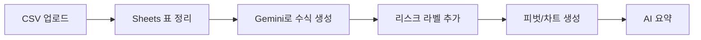

# 02. Google Sheets와 Gemini 실습

## 목표

이번 실습에서는 Google Sheets와 Gemini만으로 통상 리스크 데이터를 정리하고, 수식과 차트를 만들어 봅니다.

별도 앱 개발 없이도 다음 흐름을 먼저 검증하는 것이 목표입니다.



## 사용할 데이터

파일:

```text
data/trade_risk_workspace_ai_demo.csv
```

데이터 내용:

- 국가별 수출액
- 국가별 수입액
- 무역수지
- 수출 증가율
- 수입 증가율
- 간단한 리스크 신호

## 1단계: CSV 열기

1. Google Drive에 `data/trade_risk_workspace_ai_demo.csv`를 업로드한다.
2. Google Sheets로 연다.
3. 첫 행이 헤더로 잘 들어왔는지 확인한다.

## 2단계: Gemini로 표 정리하기

Sheets 오른쪽 위의 Gemini 패널에서 요청한다.

```text
이 데이터를 통상 리스크 분석용 표로 보기 좋게 정리해줘.
헤더를 고정하고, 숫자 컬럼은 달러 단위로 표시하고,
export_yoy_pct와 import_yoy_pct는 퍼센트로 표시해줘.
```

## 3단계: 리스크 라벨 수식 만들기

새 컬럼 이름을 `risk_label`로 만든다.

Gemini에게 요청한다.

```text
trade_balance_usd가 음수이거나 export_yoy_pct가 -5 이하이면 "주의",
import_yoy_pct가 8 이상이면 "관찰",
그 외에는 "정상"으로 표시하는 Google Sheets 수식을 만들어줘.
2행 기준 수식으로 알려줘.
```

예상 수식:

```text
=IF(OR(F2 < 0, G2 <= -5), "주의", IF(H2 >= 8, "관찰", "정상"))
```

수식을 아래 행까지 채운다.

## 4단계: AI 요약 컬럼 만들기

새 컬럼 이름을 `ai_summary`로 만든다.

2행에 아래처럼 입력한다.

```text
=AI("이 행의 수출입 데이터를 보고 통상 리스크 관점에서 한 문장으로 요약해줘. 과장하지 말고 숫자 변화 중심으로 써줘.", A2:I2)
```

확인할 점:

- AI가 숫자를 근거로 설명하는가?
- 지나치게 과장하지 않는가?
- 사람이 읽을 수 있는 업무 문장으로 바뀌는가?

## 5단계: 피벗 테이블 만들기

Gemini에게 요청한다.

```text
국가별로 2024년 exports_usd, imports_usd, trade_balance_usd를 비교하는 피벗 테이블을 만들어줘.
```

## 6단계: 차트 만들기

Gemini에게 요청한다.

```text
2024년 국가별 trade_balance_usd를 비교하는 막대 차트를 만들어줘.
무역수지가 음수인 국가는 눈에 잘 띄게 보여줘.
```

## 7단계: 분석 질문하기

Gemini에게 질문한다.

```text
이 표에서 2024년 기준 통상 리스크가 가장 커 보이는 국가는 어디야?
수출 증가율, 수입 증가율, 무역수지를 근거로 3개만 뽑아줘.
```

```text
대한민국의 2019년부터 2024년까지 흐름을 5문장 이내로 요약해줘.
수출 증가율과 무역수지 변화를 중심으로 설명해줘.
```

## 확인 포인트

- Gemini가 만든 수식을 그대로 쓰기 전에 사람이 검토했는가?
- AI 요약이 데이터와 맞는가?
- Sheets만으로도 빠른 PoC가 가능한가?
- 별도 앱 개발이 필요한 지점은 어디부터인가?
