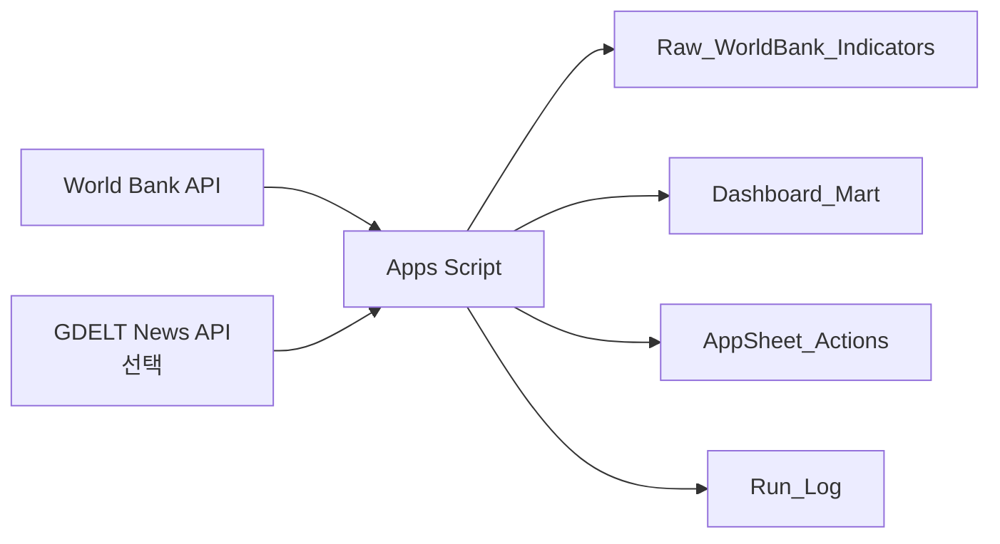

# 03. Google Apps Script 실습

## 목표

이번 실습에서는 Google Apps Script로 Google Sheets에 통상 리스크 데이터마트를 자동 생성합니다.

완성하면 Google Sheet에 아래 흐름이 생깁니다.



## 실습 파일

| 파일 | 용도 |
|---|---|
| `Code.gs` | Apps Script 본문 |
| `appsscript.json` | 권한과 실행 환경 설정 |
| `verify-local.mjs` | 로컬에서 API와 계산 흐름을 검증하는 선택 스크립트 |

## 1단계: 새 Google Sheet 만들기

1. Google Sheets에서 새 스프레드시트를 만든다.
2. 파일 이름을 `통상 리스크 Apps Script 실습`처럼 알아보기 쉽게 바꾼다.
3. 메뉴에서 `확장 프로그램 > Apps Script`를 연다.

## 2단계: Code.gs 붙여 넣기

1. Apps Script 편집기에서 기본으로 열린 `Code.gs` 내용을 모두 지운다.
2. 이 폴더의 `Code.gs` 전체 내용을 붙여 넣는다.
3. 저장한다.

## 3단계: appsscript.json 설정하기

1. Apps Script 편집기 왼쪽의 프로젝트 설정으로 이동한다.
2. `appsscript.json` 매니페스트 파일 표시 옵션을 켠다.
3. 왼쪽 파일 목록에서 `appsscript.json`을 연다.
4. 이 폴더의 `appsscript.json` 내용을 붙여 넣는다.
5. 저장한다.

## 4단계: setupWorkbook 실행

1. Apps Script 상단 함수 선택 드롭다운에서 `setupWorkbook`을 선택한다.
2. 실행 버튼을 누른다.
3. 권한 승인이 나오면 본인 Google 계정으로 승인한다.
4. 실행이 끝나면 Google Sheet 탭으로 돌아간다.

## 5단계: 만들어진 시트 확인

`setupWorkbook`이 성공하면 Google Sheet에 아래 탭들이 생긴다.

| 시트 | 내용 |
|---|---|
| `Config_Countries` | 수집 대상 국가와 GDELT 뉴스 검색어 |
| `Raw_WorldBank_Indicators` | World Bank에서 가져온 원천 지표 |
| `Raw_GDELT_News` | GDELT 뉴스 API 결과 |
| `Dashboard_Mart` | Looker Studio용 대시보드 데이터 |
| `AppSheet_Actions` | AppSheet에서 수정할 조치 목록 |
| `Run_Log` | Apps Script 실행 로그 |

`setupWorkbook` 직후에는 대부분의 시트가 헤더만 있고 비어 있는 것이 정상이다. 실제 데이터는 다음 단계에서 채운다.

## 6단계: Risk Lab 메뉴 보이게 하기

Google Sheet 탭을 새로고침한다.

상단 메뉴에 `Risk Lab`이 보이면 성공이다.

보이지 않으면:

1. Apps Script 편집기로 돌아간다.
2. 함수 선택 드롭다운에서 `onOpen`을 선택한다.
3. 한 번 실행한다.
4. Google Sheet 탭을 다시 새로고침한다.

## 7단계: 빠른 새로고침 실행

Google Sheet에서 실행한다.

```text
Risk Lab > 2. Run fast refresh (World Bank only)
```

이 메뉴는 World Bank 데이터만 가져오므로 비교적 빠르다.

실행 후 아래 시트에 행이 생겼는지 확인한다.

- `Raw_WorldBank_Indicators`
- `Dashboard_Mart`
- `AppSheet_Actions`
- `Run_Log`

## 8단계: Dashboard_Mart 확인

`Dashboard_Mart`는 Looker Studio가 읽기 좋은 형태로 만든 단일 테이블이다.

중요 컬럼:

| 컬럼 | 의미 |
|---|---|
| `risk_id` | 국가-연도 단위 고유 ID |
| `exports_usd` | 수출액 |
| `imports_usd` | 수입액 |
| `trade_balance_usd` | 무역수지 |
| `export_yoy_pct` | 수출 전년 대비 증감률 |
| `import_yoy_pct` | 수입 전년 대비 증감률 |
| `risk_score` | 계산된 위험 점수 |
| `risk_level` | `Low`, `Medium`, `High` |
| `risk_drivers` | 위험 점수에 영향을 준 원인 |
| `recommended_action` | 추천 후속 조치 |

## 9단계: AppSheet_Actions 확인

`AppSheet_Actions`는 AppSheet에서 상태를 바꿀 업무 목록이다.

중요 컬럼:

| 컬럼 | 의미 |
|---|---|
| `action_id` | 조치 항목 고유 ID |
| `risk_id` | 연결된 리스크 ID |
| `country_name` | 국가명 |
| `risk_level` | 위험 등급 |
| `owner` | 담당자 |
| `status` | 처리 상태 |
| `due_date` | 검토 기한 |
| `action_title` | 조치 제목 |
| `action_detail` | 조치 내용 |

AppSheet에서는 주로 `owner`, `status`, `due_date`, `action_detail`을 수정한다.

## 10단계: 뉴스 데이터는 선택 실행

뉴스 신호까지 붙이고 싶을 때만 실행한다.

```text
Risk Lab > 3. Refresh GDELT news only (slow)
```

주의:

- GDELT는 공개 API라 호출 제한이 있다.
- 8개 국가를 순차 호출하므로 1-3분 정도 걸릴 수 있다.
- 수업 시연에서는 먼저 fast refresh만 실행해도 충분하다.

## 주요 함수 설명

| 함수 | 역할 |
|---|---|
| `onOpen` | Google Sheet 상단에 `Risk Lab` 메뉴를 만든다. |
| `setupWorkbook` | 실습에 필요한 시트와 헤더를 만든다. |
| `runFastRefresh` | World Bank 데이터만 가져와 데이터마트를 만든다. |
| `refreshGdeltNewsOnly` | GDELT 뉴스 신호를 추가로 가져온다. |
| `runFullRefresh` | World Bank와 GDELT를 한 번에 실행한다. 느릴 수 있다. |
| `createReviewDraft` | 상위 리스크 항목을 Gmail 초안으로 만든다. |
| `fetchWorldBankIndicators_` | World Bank API를 호출한다. |
| `fetchGdeltSignals_` | GDELT API를 호출한다. |
| `buildDashboardMart_` | 원천 지표를 대시보드용 테이블로 변환한다. |
| `buildAppSheetActions_` | AppSheet에서 쓸 조치 목록을 만든다. |
| `logRun_` | 실행 결과를 `Run_Log`에 기록한다. |

코드 전체를 세부적으로 외울 필요는 없다. 이번 실습에서는 “Apps Script가 외부 API를 가져와 Sheet를 업무용 데이터 구조로 바꾼다”는 흐름을 이해하는 것이 중요하다.

## Gmail 초안 확인

`Risk Lab > 6. Create review draft`를 실행하면 Gmail 임시보관함에 초안이 생긴다.

제목 예시:

```text
[실습] 통상 리스크 Top risk 항목 검토 요청
```

초안이 안 생기면 `Run_Log`에서 오류 메시지를 확인한다.
