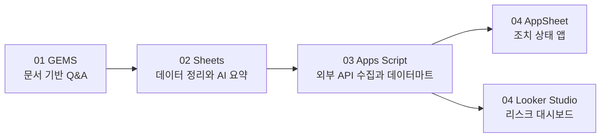

# Google Workspace Gemini 실습

이 폴더는 수업 중 학생들이 직접 열어보고 따라 할 실습 자료입니다.

## 실습 순서

| 번호 | 폴더 | 목표 |
|---|---|---|
| 01 | `01_gems` | GEMS만으로 문서 기반 업무 도우미 만들기 |
| 02 | `02_sheets` | Google Sheets와 Gemini로 데이터 분석 흐름 만들기 |
| 03 | `03_apps_script` | Google Apps Script로 Google Sheets 데이터마트 자동 생성하기 |
| 04 | `04_appsheet_looker_studio` | AppSheet와 Looker Studio(Data Studio)로 업무 화면 만들기 |

## 전체 흐름

## 주의사항

- 실습 데이터는 공개 데이터를 사용합니다.
- 사내 데이터로 실습할 때는 개인정보와 민감 정보를 반드시 제거하거나 마스킹하세요.
- Apps Script와 AppSheet는 Google 계정 권한 승인이 필요할 수 있습니다.
- Looker Studio는 예전 이름인 Data Studio로 부르는 경우가 있습니다. 현재 공식 명칭은 Looker Studio입니다.
